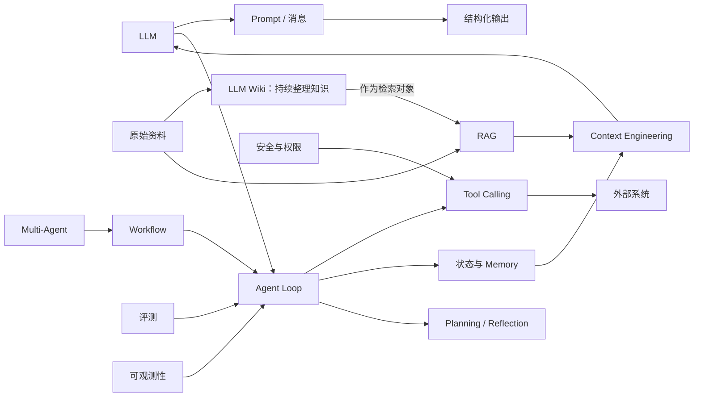
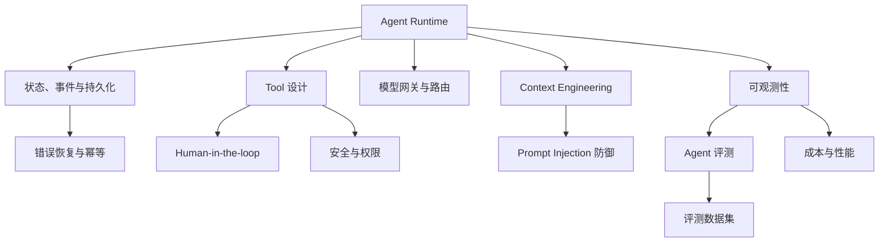

---
tags:
  - MOC
  - map
---

# AI Agent 知识地图

> [!tip] 先建立整体感觉
> 如果下面的概念关系还比较抽象，先阅读 [[00-首页/贯穿案例：重复扣款工单]]，再回来看这张图。

## 从概念进入

- 模型层：[[01-基础/01-LLM 基础]] → [[01-基础/02-Prompt 与结构化输出]] → [[01-基础/03-模型 API 与消息协议]]
- Agent 核心：[[02-核心机制/04-Tool Calling]] → [[02-核心机制/07-Agent Loop]] → [[02-核心机制/08-Planning 与 Reflection]]
- 知识与状态：[[02-核心机制/05-RAG]] → [[02-核心机制/06-Memory]] → [[02-核心机制/10-LLM Wiki]] → [[03-工程实践/Context Engineering]]
- 系统设计：[[03-工程实践/Workflow 与 Agent]] → [[02-核心机制/09-Multi-Agent]] → [[03-工程实践/Agent 系统架构]]
- 质量保障：[[06-评测安全生产/Agent 评测]] → [[06-评测安全生产/安全与权限]] → [[06-评测安全生产/可观测性与生产化]]

## 一句话总览

Agent 不是一个更长的 Prompt，而是一个由模型参与决策、能读取状态、调用受控工具、循环到终止条件，并且可以被评测和审计的软件系统。

LLM Wiki 把资料整理为持续维护的知识页面；RAG 在回答时检索外部证据，两者可以组合。上图的检索既可以使用目录、链接和关键词，也可以使用向量；检索到 Wiki 后仍要核对原始来源、权限与适用版本。

## 工程专题地图

- Runtime 深入：[[03-工程实践/状态、事件与持久化]] → [[03-工程实践/错误恢复与幂等]]
- 技术栈落地：[[03-工程实践/TypeScript 与 Java 实现对照]] → [[labs/01-agent-runtime/README|TypeScript 离线实验]]
- 知识整理实践：[[02-核心机制/10-LLM Wiki]] → [[labs/02-llm-wiki/README|LLM Wiki 最小练习]] → [[99-模板/LLM Wiki 页面模板]]
- 长任务：[[02-核心机制/07-Agent Loop]] → [[03-工程实践/异步任务与取消]]
- 权限闭环：[[03-工程实践/Tool 设计]] → [[03-工程实践/身份、凭据与委托授权]] → [[03-工程实践/Human-in-the-loop]] → [[06-评测安全生产/安全与权限]]
- 质量闭环：[[06-评测安全生产/评测数据集设计]] → [[06-评测安全生产/评测指标怎么算]] → [[06-评测安全生产/Agent 评测]] → [[06-评测安全生产/可观测性与生产化]]
- 性能闭环：[[03-工程实践/模型网关与路由]] → [[06-评测安全生产/成本与性能]]
- 可选交互：[[04-框架与生态/多模态与 Computer Use]]；概念辨析：[[07-术语与资源/常见困惑与排错]]

## 阅读材料

按问题查阅 [[07-术语与资源/官方资料与经典论文]]，不要先堆收藏再开始实践。
