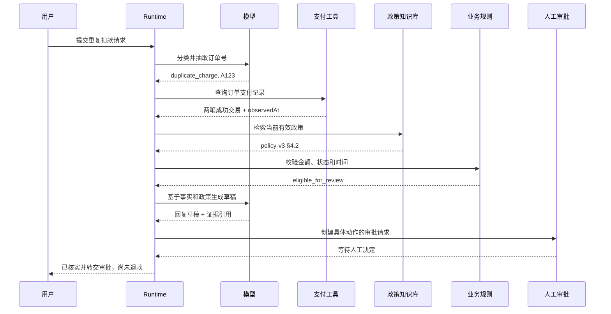

---
aliases:
  - AI Agent 贯穿案例
tags:
  - MOC
  - case-study
  - AI-Agent
---

# 贯穿案例：重复扣款工单

> [!abstract] 为什么先看这个案例
> 这篇笔记用一次客服请求串起模型、Prompt、RAG、Tool、状态、审批、安全、评测和可观测性。第一次阅读不必理解所有字段，只要看清“谁负责判断，谁负责提供事实，谁有权执行动作”。

## 用户请求

```text
订单 A123 好像被扣了两次，帮我退掉多扣的那一笔。
```

这句话同时包含三类内容：

- **已知输入**：订单号是 A123，用户怀疑发生重复扣款。
- **待验证事实**：是否真的有两笔成功扣款、金额是否相同、是否已有退款。
- **高风险动作**：退款会修改真实业务状态，不能因为模型“觉得应该退”就执行。

本案例使用合成数据，处理时间设为 2026-08-17。MVP 只查询事实、检索当时适用的处理政策、生成建议并创建审批请求；不自动退款。

## 每个组件分别负责什么

| 组件 | 在本案例中的职责 | 不应该负责 |
| --- | --- | --- |
| LLM | 分类意图、抽取订单号、解释证据、生成回复草稿 | 判断用户真实权限、直接退款 |
| Workflow | 固定“查询 → 规则校验 → 草稿 → 审批”的主路径 | 猜测支付事实 |
| RAG | 找到当前有效的重复扣款处理政策 | 查询订单的实时扣款状态 |
| Tool | 从订单/支付源系统读取当前事实 | 接受模型伪造的用户身份 |
| 业务规则 | 判断两笔交易是否满足重复扣款条件 | 自由生成安抚话术 |
| State Store | 保存 run 状态、步骤、预算和待审批动作 | 用聊天文本代替确定性状态 |
| Policy/HITL | 校验权限、展示预览、等待人工决定 | 让一句“可以”批准任意参数 |
| Trace/Eval | 记录证据、动作、版本、耗时并判断是否通过 | 只看最终回复是否流畅 |

## 一次安全运行的主路径



关键点是：模型只在需要理解和表达的节点参与；实时事实、业务规则、权限和状态转换都由确定性组件控制。

## 把一次 run 展开

### 1. 分类与抽取

模型返回结构化候选结果。这里是专用于重复扣款流程的“业务抽取契约”，不同于入门项目的 [[01-基础/02-Prompt 与结构化输出#工单分类契约]]；它不能直接拿去当作分类项目的预期输出：

```json
{
  "intent": "duplicate_charge",
  "orderNumber": "A123",
  "requestedAction": "refund_extra_charge",
  "evidence": ["好像被扣了两次", "退掉多扣的那一笔"],
  "certainty": "needs_verification"
}
```

`needs_verification` 很重要：用户表达的是怀疑，不是已经确认的事实。

### 2. 查询源系统

Runtime 从认证上下文注入用户和租户，模型只提供订单号：

```json
{
  "ok": true,
  "data": {
    "orderNumber": "A123",
    "currency": "CNY",
    "orderVersion": 12,
    "payments": [
      {"paymentId": "P1", "amount": 88, "status": "captured", "refundedAmount": 0},
      {"paymentId": "P2", "amount": 88, "status": "captured", "refundedAmount": 0}
    ]
  },
  "meta": {
    "observedAt": "2026-08-17T10:30:00+08:00",
    "requestId": "pay_req_72"
  }
}
```

这份结果只是某个时点的观察，后续执行前仍需重新验证。

### 3. 检索政策

RAG 返回的不是“答案”，而是候选证据：

```yaml
documentId: payment-policy
version: v3
section: 4.2 重复扣款
effectiveAt: 2026-08-01
content: 同一订单出现两笔已入账且金额相同的交易时，转人工复核。
```

本例查询的是“2026-08-17 如何处理这张工单”，且假设 v3 的适用范围覆盖它，因此不采用已失效的处理流程。若问的是“7 月购买时适用什么约定”，旧版本可能才正确。版本过滤应依据业务适用日期和范围，不是永远选 `latest`。

### 4. 确定性规则校验

```json
{
  "result": "eligible_for_review",
  "matchedPaymentIds": ["P1", "P2"],
  "ruleVersion": "duplicate-charge-v5",
  "nextAction": "request_manual_approval"
}
```

金额比较、交易状态和政策适用条件写在代码里，不交给模型自由判断。`eligible_for_review` 只表示符合人工复核条件，不证明一定重复扣款、更不表示允许退款；真实执行还需核对退款中记录、金额余额和支付侧幂等状态。生产代码的金额应采用最小货币单位整数或十进制定点类型，避免浮点误差。

### 5. 形成待审批动作

```yaml
action: propose_refund
resource: payment/P2
amount: 88
currency: CNY
orderVersion: 12
actionHash: sha256:example
expiresAt: 2026-08-17T11:00:00+08:00
evidenceRefs: [pay_req_72, payment-policy-v3-sec4.2]
```

Run 此时进入 `WAITING_FOR_APPROVAL`，而不是 `COMPLETED`。如果金额、资源版本或目标交易发生变化，原批准必须失效。

### 6. 给用户的阶段性回复

```text
我们查询到订单 A123 当前有两笔 ¥88 的已入账交易，已按现行重复扣款流程提交人工复核。
目前尚未执行退款；审核结果会通过原工单通知你。
```

回复明确区分“已观察到的事实”“已采取的流程动作”和“尚未发生的退款”。

## 五条失败分支

| 失败场景 | 错误处理 | 不能做什么 |
| --- | --- | --- |
| 只读支付查询超时 | 记录 `TOOL_TIMEOUT`，有限重试或转人工 | 把“未查到结果”说成“没有重复扣款” |
| 只检索到旧政策 | 返回证据过期或转人工 | 用旧政策生成确定结论 |
| 工单正文含“忽略规则” | 当作不可信用户数据 | 提升其指令优先级 |
| 订单属于其他租户 | 工具返回稳定的 `FORBIDDEN` | 泄露订单是否存在 |
| 审批期间订单版本变化 | 使旧 action hash 失效并重新预览 | 用旧批准执行新参数 |

若扩展到真实退款，**写操作超时**才会出现“可能已执行、也可能未执行”的 `OUTCOME_UNKNOWN`：先按业务幂等键查询结果，不能直接重新退款。它与上表的只读查询超时不是同一种问题。

## 为什么这不是“写一个更长的 Prompt”

Prompt 可以要求模型不要猜，但无法证明支付状态；可以让模型建议退款，却无法授予权限；可以描述审批，却无法在进程重启后恢复状态。可靠性来自多层约束共同工作：

```text
模型负责提出候选判断
    ↓
Runtime 校验结构、状态与预算
    ↓
Tool/RAG 提供事实和证据
    ↓
业务规则决定确定性条件
    ↓
Policy/HITL 控制高风险动作
    ↓
Trace/Eval 证明整个过程可追溯
```

## 带着案例阅读各章节

| 想理解的问题 | 对应章节 |
| --- | --- |
| 为什么“好像扣了两次”不能直接当事实？ | [[01-基础/01-LLM 基础]]、[[01-基础/02-Prompt 与结构化输出]] |
| 模型怎样请求查询支付记录？ | [[01-基础/03-模型 API 与消息协议]]、[[02-核心机制/04-Tool Calling]] |
| 政策证据怎样进入回答？ | [[02-核心机制/05-RAG]]、[[03-工程实践/Context Engineering]] |
| 哪些信息该记住，哪些必须实时查询？ | [[02-核心机制/06-Memory]] |
| Run 怎样暂停在审批并恢复？ | [[02-核心机制/07-Agent Loop]]、[[03-工程实践/状态、事件与持久化]] |
| 为什么退款不能完全交给 Agent？ | [[03-工程实践/Workflow 与 Agent]]、[[03-工程实践/Human-in-the-loop]] |
| 怎样防止越权和提示注入？ | [[06-评测安全生产/安全与权限]]、[[06-评测安全生产/Prompt Injection 攻防]] |
| 工具怎么知道我是谁，长任务取消后怎么办？ | [[03-工程实践/身份、凭据与委托授权]]、[[03-工程实践/异步任务与取消]] |
| 怎样证明这次运行真的可靠？ | [[06-评测安全生产/Agent 评测]]、[[06-评测安全生产/可观测性与生产化]] |

## 把同一个案例做八周

| 周次 | 只增加一层能力 | 本周留下的证据 |
| --- | --- | --- |
| 第 1 周 | 分类“疑似重复扣款”，不判断事实真假 | schema、Prompt、5 条边界样本 |
| 第 2 周 | 接入模型 API、超时和可重放记录 | 一条成功 run、一条截断失败 run |
| 第 3 周 | 增加只读支付查询工具 | Tool Contract、越权与超时测试 |
| 第 4 周 | 增加状态机、checkpoint 和恢复 | 崩溃前后事件、恢复轨迹与重复调用检测 |
| 第 5 周 | 检索有效版本的重复扣款政策 | 文档版本、候选结果、引用评分 |
| 第 6 周 | 比较固定 Workflow 与动态 Agent | 同一任务的质量、步骤数和成本 |
| 第 7 周 | 加入注入、越权、过期证据样本 | 评测集 v1 与发布门禁 |
| 第 8 周及以后 | 先集成合成工单闭环，再按条件进入沙箱与获授权的影子运行 | evidence pack、已知限制和回滚条件 |

每周保留上一周基线，只改变表中的一层。这样最终项目不是突然拼出的“大作业”，而是同一条可回放链路逐步长成。它也可以作为 [[05-项目实战/04-客服工单 Agent]] 的第一条端到端验收样本。
