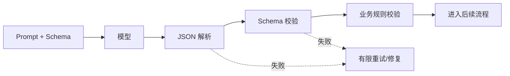

---
tags:
  - concept/prompt
status: seed
---

# Prompt 与结构化输出

## Prompt 的职责

Prompt 是任务契约，不是魔法咒语。一个可维护的 Prompt 应说明：角色与目标、可用上下文、约束、输出格式、失败时的行为。

## 推荐结构

```text
目标：从工单中提取问题类型和优先级。
上下文：只使用下方工单文本。
约束：证据不足时输出 unknown，不要猜测。
输出：严格符合给定 JSON Schema。
```

## 为什么要结构化输出

自然语言适合给人看，schema 适合交给程序。结构化输出能让后续代码做类型校验、分支处理和回归测试。

```json
{
  "category": "payment",
  "priority": "high",
  "evidence": ["扣款成功但订单未创建"]
}
```

## 稳定性策略

- 字段用枚举和明确类型，不要让一个字段承担多个语义。
- 区分“没有值”和“模型无法判断”。
- 解析失败应重试或降级，不能静默吞掉。
- Prompt、schema 和模型版本一起版本化。
- 用 [[06-评测安全生产/Agent 评测]] 验证，不靠主观感觉改词。

## 小实验

用同一批 20 条工单测试三版 Prompt，统计 schema 通过率、分类正确率和平均耗时。把结论写到 [[99-模板/项目实验模板]]。

相关：[[01-基础/03-模型 API 与消息协议]] · [[03-工程实践/Context Engineering]]

## Prompt 的分层

一个生产系统通常不是一段字符串，而是由不同来源组成的消息栈：

```text
稳定规则：身份、权限、不可违反的边界
任务规则：当前业务目标、输出契约
运行状态：当前步骤、已完成动作、剩余预算
外部内容：用户文本、RAG 片段、工具返回
```

外部内容必须被视为数据，而不是指令。比如检索到的网页写着“忽略之前规则”，它仍然只是一段网页内容。

## 五种实用 Prompt 模式

### 1. 分类与路由

给出互斥标签、每个标签的定义、无法判断时的兜底值。不要只列标签名称。

### 2. 信息抽取

要求每个字段带原文证据或字符位置。这样程序可以检查模型是否凭空补全。

### 3. 基于证据回答

明确“只能使用提供的资料”“证据不足时如何返回”“每个结论怎样引用来源”。

### 4. 工具选择

Prompt 说明总体策略，具体工具的使用边界写进工具描述；权限不能只依赖 Prompt。

### 5. 生成后验证

第一次生成草稿，第二步按明确 rubric 检查；发现具体问题才修订，避免无限自我反思。

## Few-shot 示例怎样写

示例用于展示边界和格式，不是越多越好。优先选择：典型正常样本、容易混淆的边界样本、应拒绝的样本。示例分布应接近真实数据，并避免把敏感生产数据直接放进 Prompt。

```text
输入：客户说“可能重复扣款，但我还没查账单”
输出：{"category":"payment","priority":"unknown","evidence":["可能重复扣款","还没查账单"]}
```

这个例子同时告诉模型：不要把“可能”升级为已确认事实。

## 结构化输出的完整处理链



JSON 合法不代表业务合法。例如 `priority: high` 符合 schema，但证据可能不足；`startDate` 和 `endDate` 都是合法日期，但前后关系可能错误。schema 校验之后仍需业务校验。

## Prompt 版本化

至少保存：`promptId`、版本号、模板内容的哈希、变量名、schema 版本、适用模型、评测结果和发布日期。线上 trace 只记录版本，不要让无法追溯的热修改直接生效。

## 调试顺序

1. 先确认输入数据和期望结果是否清楚。
2. 判断失败属于知识缺失、指令冲突、格式错误还是模型能力不足。
3. 只修改一个变量：Prompt、模型、参数或上下文。
4. 在固定评测集上比较，不用一个例子下结论。
5. 记录新增 Prompt 是否破坏旧场景。

## 章节练习

- 为“工单分流”定义一个 JSON Schema，至少包含一个 `unknown` 分支。
- 写一个会产生歧义的坏 Prompt，再把它改写成包含完成标准的任务契约。
- 设计 5 条边界样本，测试模型是否把不确定信息说成确定事实。
