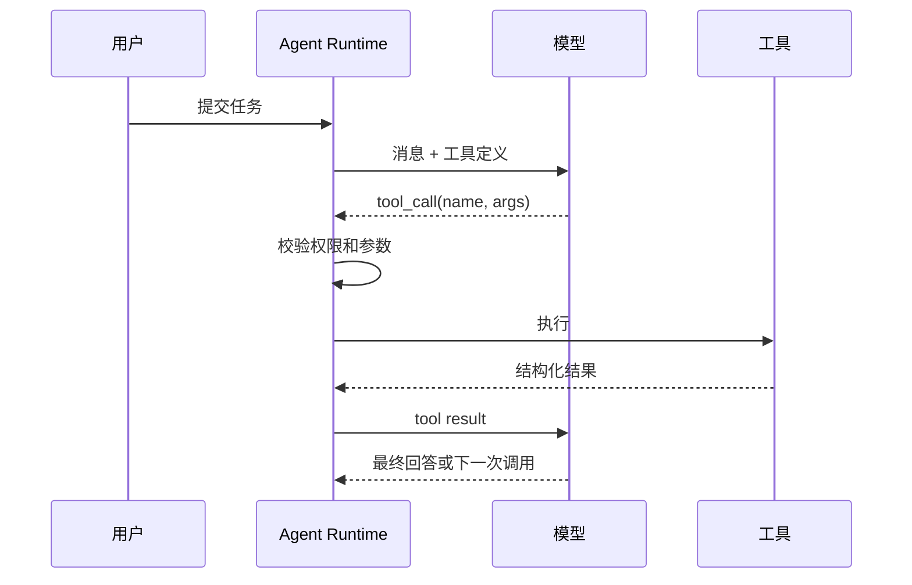
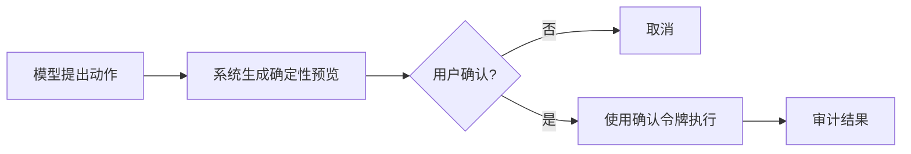

---
aliases:
  - Function Calling
tags:
  - concept/tool-calling
status: seed
---

# Tool Calling

## 核心机制

模型不直接执行函数。它生成一个“想调用哪个工具、参数是什么”的结构化请求；Agent Runtime 校验并执行，再把结果作为 tool message 交回模型。



## 一个好工具的特征

- 单一职责，名称体现业务动作。
- 参数 schema 明确，枚举优于自由文本。
- 返回数据紧凑、稳定、可序列化。
- 读操作与写操作分开。
- 有超时、幂等、错误码和审计字段。

## 风险边界

模型建议调用，不代表获得授权。执行层必须独立完成：身份认证、参数校验、资源授权、速率限制和高风险动作确认。

## 例子

`search_orders(query)` 比 `run_sql(sql)` 安全；`prepare_refund(orderId)` 与 `confirm_refund(token)` 分开，比一步退款更容易审批和审计。

深入：[[03-工程实践/Tool 设计]] · [[06-评测安全生产/安全与权限]] · [[02-核心机制/07-Agent Loop]]

## Tool Calling 的完整生命周期

1. Runtime 根据当前用户和任务筛选可见工具。
2. 把工具名称、描述和参数 schema 发给模型。
3. 模型返回零个、一个或多个 tool call。
4. Runtime 解析参数并做 schema 校验。
5. 策略层验证用户、租户、资源和动作权限。
6. 如有副作用，生成预览并等待确认。
7. 执行器带上超时、取消、幂等键调用外部系统。
8. 将结果规范化、裁剪、脱敏后回填模型。
9. 记录审计事件与 trace。
10. 模型决定继续调用还是形成最终回答。

这里真正由模型完成的只有第 3 和第 10 步。其余都是确定性软件工程。

## 工具描述如何影响选择

对模型而言，工具描述就是 API 文档。描述至少回答：

- 这个工具读取还是修改数据？
- 什么情况下使用，什么情况下不要用？
- 需要哪些前置条件？
- 返回什么，找不到时怎样表示？

坏描述：`manage_order - 管理订单`。

好描述：`get_order_status - 按订单号只读查询当前状态和最后更新时间；找不到时返回 NOT_FOUND；不得用于搜索客户名或修改订单。`

## 结果契约

建议工具结果保持机器可读：

```json
{
  "ok": false,
  "error": {
    "code": "ORDER_NOT_FOUND",
    "message": "No order matched the provided order number",
    "retryable": false
  },
  "meta": {
    "requestId": "req_123",
    "observedAt": "2026-07-14T10:00:00+08:00"
  }
}
```

`message` 是给模型理解的有限说明，内部堆栈和数据库细节留在受控日志中。结果还应明确时间，因为“订单是 paid”只有在某个观察时点才成立。

## 并行工具调用

互不依赖的只读调用可以并行，例如同时读取三个文件。但并行前要确认：

- 调用之间没有顺序依赖。
- 每个调用有独立 ID，返回不会串位。
- 并发量有限制。
- 一个调用失败时，是否取消其他调用有明确策略。
- 写操作不会因竞态破坏业务约束。

## 写操作的两阶段模式



确认页面必须展示真实执行参数，而不是模型的自然语言总结。确认令牌应绑定用户、资源、动作、参数和过期时间，防止确认后参数被替换。

## 常见故障分析

- 选错工具：检查命名、描述是否重叠，以及是否暴露了过多工具。
- 参数编造：收紧 schema、提供查找工具，不要让模型猜 ID。
- 循环调用：让结果带明确状态，并在 Runtime 棚栏中检测重复。
- 结果过大：支持字段选择、分页、摘要和原始资源引用。
- 写入不确定：使用幂等键与“查询执行结果”工具，不盲目重试。

## 练习

把“发送邮件”设计成 `draft_email`、`preview_email`、`send_email` 三个阶段，写出每一步的输入、返回、权限与审计字段。
