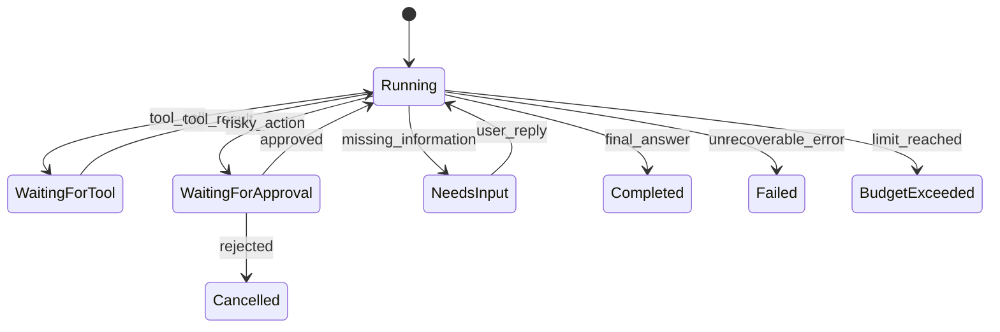

---
tags:
  - concept/agent-loop
status: seed
---

# Agent Loop

> [!abstract] 本章读完能做什么
> 能手工跟踪一次“提出动作 → 校验 → 执行 → 回填”的循环，并说清它何时等待、何时停止。先读 [[02-核心机制/04-Tool Calling]]；也可以先跑 [离线 Runtime 实验](../labs/01-agent-runtime/README.md)，对照输出理解每一步。

## Agent 的最小运行循环

```text
初始化目标与状态
while 未达到终止条件:
    构造本轮上下文
    请求模型决定下一步
    校验决定
    执行工具或生成结果
    记录观察与状态
返回最终结果和完整轨迹
```

LLM 负责提出下一步，Runtime 负责执行、限制和记录。把所有控制权交给模型，会让系统难以预测和审计。

## 必须有的护栏

- 最大步数、最大 token、最大成本和截止时间。
- 工具白名单、参数校验、读写权限分离。
- 重复动作检测和失败计数。
- 用户取消与高风险动作人工确认。
- 清晰的完成、拒绝、失败、超时状态。

## 终止条件

成功完成只是其中一种。还应包含：证据不足、需要用户补充、需要审批、无法恢复的工具错误、预算耗尽。

## 最小状态

`goal`、`messages`、`stepCount`、`observations`、`pendingApproval`、`budget`、`finalStatus`。

## 从 while 循环到显式状态机

简单循环适合学习，生产系统更适合显式状态机：



状态机让暂停、恢复和审计变得明确。每次状态变化都应由事件触发，并带上 run ID、step ID 和版本信息。

## 一轮循环的伪代码

```text
runStep(state):
    assert state.status == RUNNING
    if cancelled(state): return cancelRun(state)
    if limitsReached(state): return stopWithBudgetReason(state)
    context = contextBuilder.build(state)
    decision = model.generate(context, visibleTools)
    state = recordModelUsageAndIncrementStep(state, decision)
    if cancelled(state): return cancelRun(state)
    if deadlineExpired(state): return stopWithDeadlineReason(state)
    validated = decisionValidator.validate(decision, state)

    if validated.type == INVALID:
        return boundedRepairOrFail(state, validated.errors)
    if validated.type == REFUSAL:
        return refuse(state, validated.reason)
    if validated.type == NEED_INPUT:
        return pauseForInput(state, validated.question)
    if validated.type == FINAL:
        return verifyCompletionOrFail(state, validated.output)

    # 余下必须是已注册工具的 TOOL_CALL，绝不执行任意输出。
    assert validated.type == TOOL_CALL
    permission = policy.authorize(authContext, validated, state)
    if permission == DENY: return recordDeniedAction(state, validated)
    if permission == REQUIRE_APPROVAL:
        return pauseForApproval(state, validated)

    # 模型调用期间可能已经超时、耗尽预算或收到取消。
    if cancelled(state): return cancelRun(state)
    if limitsReached(state): return stopWithBudgetReason(state)
    result = toolExecutor.execute(validated, deadline, idempotencyKey)
    return appendObservation(state, validated, result)
```

这是讲解控制分支的伪代码，不是某个 SDK 的接口。图中的 `Running/NeedsInput` 与代码里的 `RUNNING/NEED_INPUT` 是不同命名风格，项目内应统一。正式实现中，模型和工具返回结果，再由 Runtime 记录事件、更新状态；工具的真实外部副作用则需要另外核对。预算需要调用前预留上限、调用后结算，不能只在产生费用后才检查。

审批通过不是永久授权：恢复时应验证批准绑定的参数、资源版本和有效期，再重新鉴权。`FINAL` 也只是候选结果；还要检查必需任务是否完成、是否仍有待处理的工具或审批，才能把 run 标为完成。

> [!example]- 帮助理解：一次运行怎样逐步推进
> | Step | 模型提出的下一步 | Runtime 完成的工作 | State 变化 |
> | --- | --- | --- | --- |
> | 0 | — | 创建目标“读取项目版本” | `RUNNING, stepCount=0` |
> | 1 | `find_files("package.json")` | 校验路径、执行并记录命中 | `stepCount=1`，新增 observation |
> | 2 | `read_file(...)` | 检查预算、读取有限行数 | `stepCount=2`，更新 token usage |
> | 3 | 输出最终答案 | 检查无待处理工具或审批 | `COMPLETED` |
>
> 模型只是提出每一步；状态转换、预算累计和完成确认始终由 Runtime 执行。

## Budget 是多维的

除了最大步数，还要控制：输入/输出 token、总费用、工具调用次数、并发量、外部 API 配额和总墙钟时间。一个便宜的无限循环仍然会占用资源并影响用户体验。

## 错误恢复策略

| 失败 | 可以采取的动作 |
| --- | --- |
| 工具参数校验失败 | 把字段级错误回填模型，允许有限纠正 |
| 工具暂时不可用 | 有上限地重试或切换只读降级工具 |
| 找不到资源 | 请求用户补充，不要重复相同调用 |
| 写操作结果未知 | 按幂等键查询结果，禁止盲目重试 |
| 模型输出无法解析 | 一次结构修复后失败退出 |
| 上下文超限 | 按确定策略裁剪并记录，不静默丢关键约束 |

## 检测无效循环

为每个动作生成规范化指纹：工具名 + 规范化参数 + 关键状态版本。相同指纹连续出现且没有新观察时，说明 Agent 没有取得进展。此时应停止、换策略或请求用户输入。

## 可恢复运行

长任务需要 checkpoint。至少保存状态版本、待执行动作、已完成动作、工具结果引用、预算消耗和待审批信息。恢复时先检查外部世界是否变化，不能假设暂停前的所有观察仍然有效。

## 章节练习

画出 Mini Agent CLI 的状态机，并为“文件不存在”“用户取消”“shell 等待审批”“达到最大步数”分别写出终止或恢复路径。

> [!example]- 示例答案（参考）
> ```text
> RUNNING -> WAITING_FOR_TOOL -> RUNNING -> COMPLETED
> RUNNING -> NEEDS_INPUT -> RUNNING
> RUNNING -> WAITING_FOR_APPROVAL -> RUNNING / CANCELLED
> RUNNING -> CANCELLED
> RUNNING -> BUDGET_EXCEEDED
> ```
> - 文件不存在：工具返回 `NOT_FOUND`；有候选路径则允许一次修正，否则进入 `NEEDS_INPUT`。
> - 用户取消：写入取消事件，传播 cancel signal，最终进入 `CANCELLED`。
> - Shell 等待审批：保存真实参数和 action hash，进入 `WAITING_FOR_APPROVAL`；批准后重新校验再执行。
> - 达到最大步数：保存当前观察和未完成原因，进入 `BUDGET_EXCEEDED`，不再调用模型。

下一步：[[05-项目实战/02-Mini Agent CLI]] · [[03-工程实践/异步任务与取消]] · [[02-核心机制/08-Planning 与 Reflection]]
