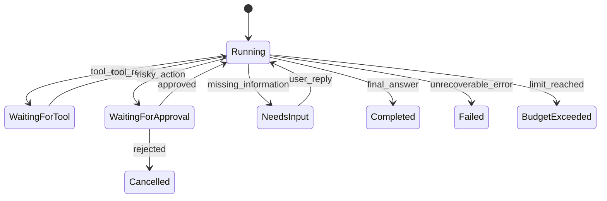

---
tags:
  - concept/agent-loop
status: seed
---

# Agent Loop

## Agent 的最小运行循环

```text
初始化目标与状态
while 未达到终止条件:
    构造本轮上下文
    请求模型决定下一步
    校验决定
    执行工具或生成结果
    记录观察与状态
返回最终结果和完整轨迹
```

LLM 负责提出下一步，Runtime 负责执行、限制和记录。把所有控制权交给模型，会让系统难以预测和审计。

## 必须有的护栏

- 最大步数、最大 token、最大成本和截止时间。
- 工具白名单、参数校验、读写权限分离。
- 重复动作检测和失败计数。
- 用户取消与高风险动作人工确认。
- 清晰的完成、拒绝、失败、超时状态。

## 终止条件

成功完成只是其中一种。还应包含：证据不足、需要用户补充、需要审批、无法恢复的工具错误、预算耗尽。

## 最小状态

`goal`、`messages`、`stepCount`、`observations`、`pendingApproval`、`budget`、`finalStatus`。

实践：[[05-项目实战/02-Mini Agent CLI]] ；进一步学习：[[02-核心机制/08-Planning 与 Reflection]]

## 从 while 循环到显式状态机

简单循环适合学习，生产系统更适合显式状态机：



状态机让暂停、恢复和审计变得明确。每次状态变化都应由事件触发，并带上 run ID、step ID 和版本信息。

## 一轮循环的伪代码

```text
runStep(state):
    assert state.status == RUNNING
    assert state.stepCount < limits.maxSteps
    context = contextBuilder.build(state)
    decision = model.generate(context, visibleTools)
    validated = decisionValidator.validate(decision, state)

    if validated.type == FINAL:
        return complete(state, validated.output)

    if policy.requiresApproval(validated):
        return pauseForApproval(state, validated)

    result = toolExecutor.execute(validated, deadline, idempotencyKey)
    return appendObservation(state, validated, result)
```

注意：模型调用和工具调用都不直接修改整个 state，而是产生事件，由状态归并逻辑更新。这让回放与测试更简单。

## Budget 是多维的

除了最大步数，还要控制：输入/输出 token、总费用、工具调用次数、并发量、外部 API 配额和总墙钟时间。一个便宜的无限循环仍然会占用资源并影响用户体验。

## 错误恢复策略

| 失败 | 可以采取的动作 |
| --- | --- |
| 工具参数校验失败 | 把字段级错误回填模型，允许有限纠正 |
| 工具暂时不可用 | 有上限地重试或切换只读降级工具 |
| 找不到资源 | 请求用户补充，不要重复相同调用 |
| 写操作结果未知 | 按幂等键查询结果，禁止盲目重试 |
| 模型输出无法解析 | 一次结构修复后失败退出 |
| 上下文超限 | 按确定策略裁剪并记录，不静默丢关键约束 |

## 检测无效循环

为每个动作生成规范化指纹：工具名 + 规范化参数 + 关键状态版本。相同指纹连续出现且没有新观察时，说明 Agent 没有取得进展。此时应停止、换策略或请求用户输入。

## 可恢复运行

长任务需要 checkpoint。至少保存状态版本、待执行动作、已完成动作、工具结果引用、预算消耗和待审批信息。恢复时先检查外部世界是否变化，不能假设暂停前的所有观察仍然有效。

## 章节练习

画出 Mini Agent CLI 的状态机，并为“文件不存在”“用户取消”“shell 等待审批”“达到最大步数”分别写出终止或恢复路径。
