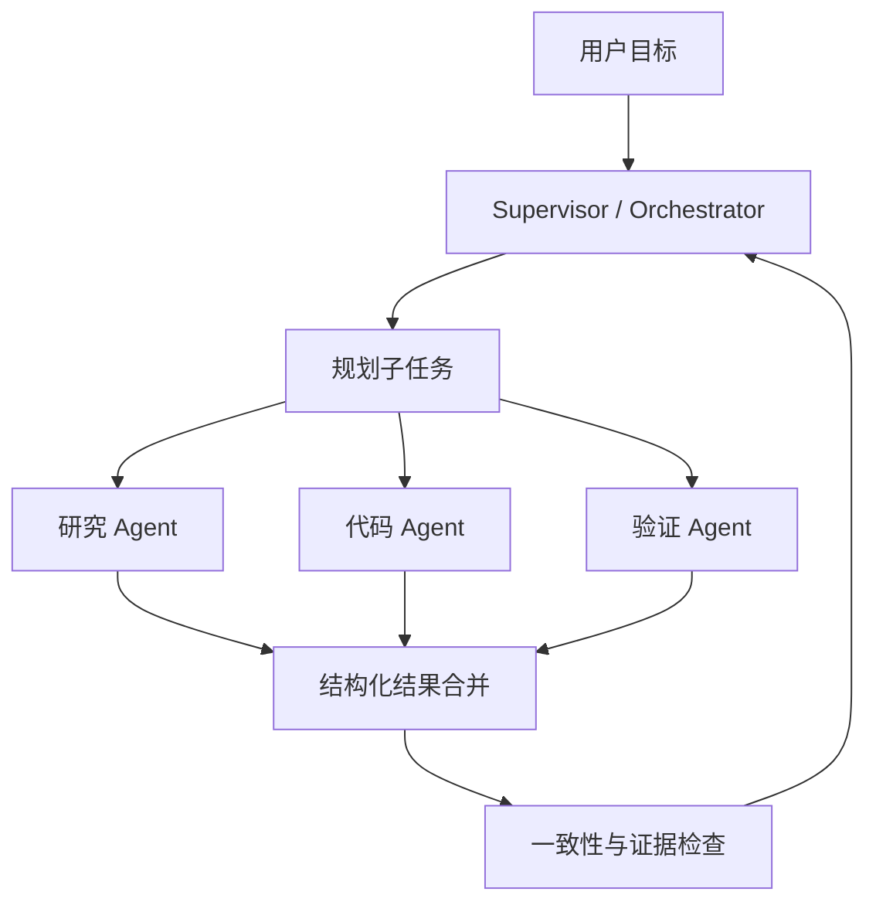

---
tags:
  - concept/multi-agent
status: seed
---

# Multi-Agent

## 一句话定义

Multi-Agent 是由编排层让多个角色化执行单元协作完成任务。重点是任务分解、上下文隔离、通信协议和结果合并，不是让几个模型随意聊天。

## 常见模式

| 模式 | 适合场景 | 主要风险 |
| --- | --- | --- |
| Supervisor + Workers | 可并行的独立子任务 | 调度和合并错误 |
| Pipeline | 固定的阶段交接 | 上游错误逐级放大 |
| Debate/Review | 需要不同视角检查 | 成本高、共识未必正确 |
| Agent as Tool | 主 Agent 按需调用专家 | 接口和责任边界不清 |

## 什么时候值得使用

只有当任务能清楚切成相对独立的上下文、需要不同工具权限，或并行能显著降低耗时时才考虑。单 Agent 加几个好工具通常更容易调试。

## 通信契约

每个子任务应包含：目标、输入、允许的工具、产出 schema、完成标准、预算和失败返回。交付的是结构化结果与证据，不是整段思考过程。

## 设计检查

- 是否真的存在可独立并行的工作？
- 哪个组件拥有最终决定权？
- 冲突结果如何验证和合并？
- 子 Agent 是否看到了超出权限的上下文？

相关：[[03-工程实践/Workflow 与 Agent]] · [[06-评测安全生产/Agent 评测]]

## 编排层必须负责什么

编排层处理子任务依赖、并发限制、超时、重试、权限、共享预算和最终合并。子 Agent 不应自行发现并无限创建更多 Agent。

## 上下文隔离

每个 Worker 只拿到完成子任务需要的信息。这既减少 token，也降低隐私和提示注入风险。共享背景应版本化；子任务结果用 schema 返回，并附证据引用。

## 共享状态的三种方式

1. **消息传递**：输入输出明确，最容易追踪。
2. **共享 blackboard**：适合多个 Worker 增量贡献，但需要并发和版本控制。
3. **事件流**：适合长任务与异步系统，但调试和最终一致性更复杂。

学习阶段优先使用主 Agent 调用“专家工具”的方式，本质上仍是清楚的函数边界。

## 冲突结果怎样处理

- 先比较来源和证据，不按 Agent 数量投票。
- 能由确定性工具验证的结论直接验证。
- 无法自动裁决时保留分歧并交给用户。
- 合并器不应凭空补充 Worker 没有提供的事实。

## 成本模型

多 Agent 会复制系统 Prompt 和背景上下文，还会增加合并与评审调用。估算总成本时应包含所有 Worker、重试、评审和共享检索，而不是只看最终一次回答。

## 最小实验

选择一个可以拆成三个独立调研问题的任务，对比：

- 单 Agent 顺序执行
- 主 Agent + 三个并行 Worker

记录完成时间、总 token、正确率、重复内容和合并错误。如果并行方案没有明显收益，就保留单 Agent。
