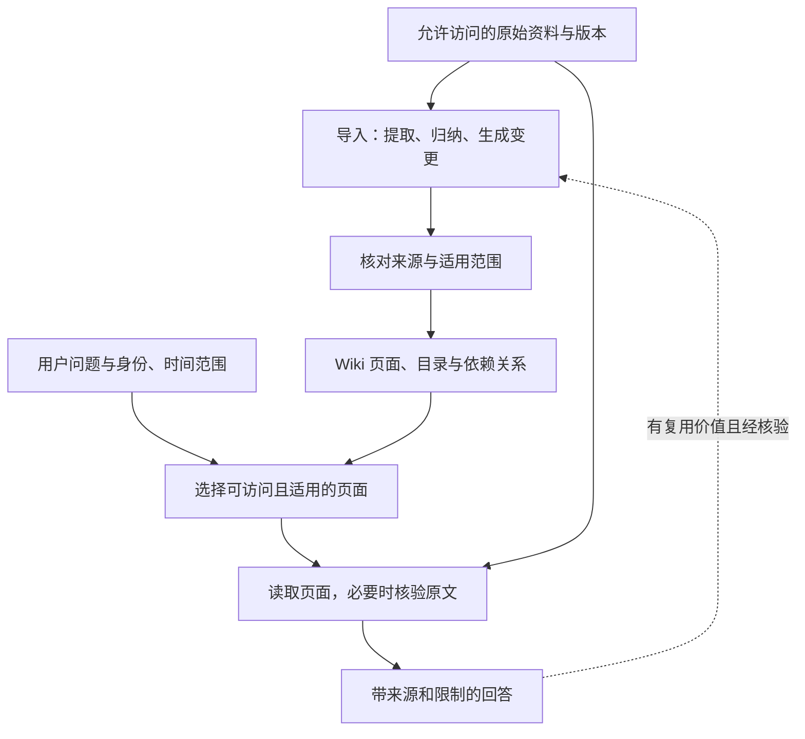

---
tags:
  - concept/llm-wiki
  - concept/rag
  - concept/memory
status: seed
reviewed: 2026-09-30
---

# LLM Wiki

> [!abstract] 本章读完能做什么
> 能区分知识整理与检索，判断是否需要向量模型/数据库，并用带来源的 Markdown 做一次“导入 → 问答 → 更新 → 检查”练习。前置：[[02-核心机制/05-RAG]]、[[02-核心机制/06-Memory]]。动手入口：[无向量库的 LLM Wiki 练习](../labs/02-llm-wiki/README.md)。

## 一句话定义

LLM Wiki 是让大模型把资料整理成可持续维护的知识页面：保留原始资料，在其上编写主题总结、概念解释和跨文档关联，后续根据新证据修订。

本章讨论 Karpathy 描述的知识库模式，不特指某个同名应用，也不是统一的技术标准。原文区分原始资料、生成的 Wiki 和维护规则，并提出导入、查询、检查三类操作。[模式出处](https://gist.github.com/karpathy/442a6bf555914893e9891c11519de94f)

**知识写在外部文件里，不是写进模型权重。** 换模型后仍可读取这些文件；但新的会话必须重新获得目录、相关页面或检索工具，不能假设模型自动记得全部内容。

## 与 RAG、Memory 分别是什么关系

| 概念 | 主要回答的问题 | 在客服案例中的作用 |
| --- | --- | --- |
| RAG | 回答当前问题时，从外部取哪些证据？ | 找出本工单适用的政策和来源 |
| LLM Wiki | 如何把多份资料整理成可复用、可更新的知识？ | 维护“重复扣款处理”主题页，关联政策与历史分析 |
| Memory | 哪些信息需要跨步骤或跨会话保留？ | 记住用户语言偏好、已确认约束或任务进度 |

它们可以组合：Wiki 是长期知识的一种载体，RAG 可以检索 Wiki，Runtime 另行保存任务状态。Wiki 中写了“待审批”，不能代替业务系统里的真实审批状态。

### 它能替代 RAG 吗

可以替代某些“原文切块 + 向量索引”的实现，但不意味着消除了检索。目录定位、全文搜索、沿链接阅读，再基于选中的内容回答，也是在用外部证据增强生成。

比较时，应把“基础文档 RAG”与“维护 Wiki 后再查询”的两种实现放在一起，而不是把所有 RAG 说成每次从零归纳。GraphRAG 的索引阶段就会生成实体、关系及社区报告；查询阶段可以使用这些预先整理的内容。[GraphRAG 索引](https://microsoft.github.io/graphrag/index/overview/) · [全局查询](https://microsoft.github.io/graphrag/query/global_search/)

| 比较项 | 基础文档 RAG | 维护 Wiki 后查询 |
| --- | --- | --- |
| 导入时 | 解析、分块、建立索引 | 另做归纳、来源关联与页面修订 |
| 提问时 | 查找原文片段并组织答案 | 优先查主题页，必要时回到原文 |
| 可复用成果 | 原文与索引；也可扩展摘要/缓存 | 额外保存人能阅读的综合知识页面 |
| 典型失误 | 漏检索、片段缺少上下文 | 整理时写错或漏掉条件，后来反复复用 |
| 更新工作 | 更新原文、索引及相关缓存 | 还要修订依赖该来源的页面与结论 |

## 需要哪些组件

| 组件 | 是否必需 | 职责 |
| --- | --- | --- |
| 生成式 LLM | 自动整理与自然语言问答时需要 | 阅读、归纳、修订和组织答案 |
| 文件或其他持久存储 | 需要 | 保存原文、页面、来源关系和版本 |
| 目录、链接、全文搜索 | 最小实现可采用 | 找到本次需要的页面 |
| Embedding 模型 | 可选 | 给语义检索生成向量 |
| 向量数据库 | 可选 | 管理向量、元数据及相似度查询 |
| Obsidian、MCP、图数据库 | 可选 | 分别提供浏览、工具接入或关系查询能力 |

**不使用向量库，也能做 LLM Wiki；使用向量检索，也不一定需要独立部署数据库。** 本地向量索引可以满足一些需求。页面数量、查询类型、权限要求和实际漏检情况，才是是否增加检索设施的依据。

关键词搜索容易漏掉不同措辞。例如用户问“多扣的钱什么时候回来”，页面却只写“重复交易退款到账时效”。可以先让模型改写查询、使用同义词，再评估是否需要混合检索；不要在没有失败样本时先搭完整向量基础设施。

## 从原文到答案的两条链路



两条链路都受权限约束。先过滤可访问资料，再交给模型整理或回答；不能先把所有租户资料汇总进一页，再要求模型“不要泄露”。

一个教学目录可以是下面这样；它是结构示意，不是本仓库已运行的服务：

```text
knowledge/
  schema.md           页面规范、导入范围、维护与问答规则
  raw/                原始资料及版本；导入过程不改写原文
  wiki/
    index.md          页面目录、简介与入口
    topics/           主题总结与比较
    sources/          来源摘要与引用定位
    log.md            导入、修订和检查记录
```

“导入不改写原文”用于保留证据，不表示可以永久保留已被要求删除的资料。撤回、权限变更和删除需要另有生命周期流程。

## 三种操作应该留下什么

### 1. 导入：保存整理成果，也保存根据

新资料进入时，先标识来源、版本和权限，再提取结论，寻找需要新增或更新的页面。每条关键结论应能回到具体来源和章节，不能只在页尾堆一串链接。

建议保存稳定的 `sourceId`、版本或内容哈希、定位信息、业务生效范围，以及页面到来源的依赖。`updatedAt` 只能说明何时修改文件，不能替代政策生效时间。可从 [[99-模板/LLM Wiki 页面模板]] 开始。

同一来源版本重复导入，应复用同一来源身份，避免重复建页和把重复材料算成多份独立证据。允许增加一条“检查无变化”的日志，不要求模型每次输出逐字相同。

### 2. 查询：先找对适用内容，再回答

先明确问题、用户权限和业务日期，再读目录、搜索页面。页面足够支持一般解释时可直接引用；涉及数字、例外条件、冲突或时间敏感结论时，应核对原文。

没有答案、来源冲突、证据过期，需要明确说明限制。引用能打开只证明链接存在，还要检查它是否支持这一句结论。问答结果写回时必须重新核验；一条未经证实的猜测不能因为保存成 Markdown 就升级为事实。

### 3. 检查：修复资料变化造成的影响

检查断链、孤立页面、未解决冲突、旧版本结论和缺失来源。来源更新后，用依赖关系找到受影响页面；完成修订或标记待核验之前，不把这些结论作为当前有效知识。

并发维护时，应检测页面版本变化再合并，避免两个 Agent 各自保存、后写覆盖先写。涉及重要业务规则的修订要有可审阅的差异，Git 可以保存版本，但 Git 本身不会校验事实。

## 用同一个客服问题理解边界

在 [[00-首页/贯穿案例：重复扣款工单]] 中，Wiki 可以整理重复扣款的定义、复核流程和政策关联；它无法证明订单 A123 今天是否退款成功。

| 问题 | Wiki 能提供什么 | 还缺什么 |
| --- | --- | --- |
| 为什么两笔成功交易仍需人工复核？ | 有来源的规则解释和适用条件 | 具体工单的事实核验 |
| 某笔退款适用哪个到账时效？ | 政策版本、日期分界和例外 | 审批日期、支付渠道等适用字段 |
| A123 已经退了吗？ | 查询流程说明 | 支付源系统的实时结果 |
| 能否直接替用户退款？ | 流程知识 | 权限、业务校验、具体动作审批与幂等控制 |

> [!example]- 帮助理解：总结丢一个条件，会发生什么
> 独立练习中的合成政策规定：演练店 A 的 CNY 银行卡原路退款，审批通过日在 2026-08-01 至 2026-08-31 适用 3–5 个工作日；2026-09-01 起适用 2–4 个工作日。资料没有给出 2026-08-01 之前的时限。
>
> 如果 Wiki 只写“退款 2–4 天到账”，就丢了门店、渠道、币种、审批日期和“工作日”。即使检索完全正确，仍会给旧审批、其他渠道或自然日问题错误答案。
>
> 这是导入/维护阶段的失真，应修订页面和来源映射；单纯提高检索 Top K 不会修好。该演练政策与贯穿案例的 `payment-policy v3` 是不同的合成资料。

## 如何选择：先看任务，再看规模

| 需求 | 可考虑的起点 | 验证重点 |
| --- | --- | --- |
| 个人学习、反复研究同一主题 | Wiki + 目录/全文搜索 | 关联是否有用、结论是否保留来源 |
| 经常查精确条款、资料变化频繁 | 原文检索为主，Wiki 辅助导航 | 适用版本、更新延迟和引用准确性 |
| 既要概览，又要核对细节 | 检索 Wiki 后按来源回查原文 | 是否因摘要遗漏必要证据 |
| 多租户、大量资料 | 在权限边界内组合索引与知识整理 | 访问控制、同步、删除和检索评测 |

不设“超过几百篇就一定需要向量库”的硬阈值。先记录目录/关键词方案在哪些问题上失败，再决定增加同义词、混合检索、重排或图导航。

## 成本和评测要覆盖维护阶段

Wiki 将一部分归纳工作提前，但不会让维护免费。比较同一批来源、同一组问题、相同权限与评审标准下的方案：

```text
总成本 = 首次整理 + 后续更新/核验 + 所有问答 + 检索/存储 + 失败重试
```

不能只比较整理完成后的单次问答成本。记录生成与 Embedding 模型版本（若使用）、规则版本、原文快照、导入时间和查询时间；模型价格与思考档位应按实际使用环境记录，不在教材中固化某款模型永远最优。

至少分别检查：整理保真度、证据覆盖、引用支持性、更新后的适用性，以及权限/注入边界。沿用 [[06-评测安全生产/评测指标怎么算]] 的分母定义，并同时报告关键条件遗漏，避免漂亮的平均分掩盖高风险错误。

## 最小练习与自测

完成 [LLM Wiki 练习包](../labs/02-llm-wiki/README.md)：先用少量原文生成页面，再逐阶段加入版本变更、冲突与撤回事件。它不要求安装 Embedding 或向量数据库；需要你使用已有 Agent，或手工模拟过程。LLM 调用是否收费取决于所用服务。

1. 画出原文、Wiki、检索、模型与实时工具的职责。
2. 为一个结论标出来源、版本、章节和适用日期；说明它不能回答什么。
3. 重复导入同一版本，检查是否制造了重复事实。
4. 更新或撤回来源，检查旧结论是否仍被当作有效答案。
5. 比较直接查原文和先查 Wiki 的表现，保留失败样本与实际记录。

> [!example]- 示例答案（参考）
> - Wiki 保存经整理的知识；检索选择本次证据；模型组织答案；支付工具提供实时状态。
> - 日期和渠道不明时，不能直接套用最新到账时效。
> - 重复导入复用来源身份；引用两遍同一文件不算两份佐证。
> - 来源撤回后，标记依赖结论待核验；若需删除数据，还要处理索引、缓存与共享副本。
> - 没有实际运行记录时只能写“期望行为”，不能写“评测通过”。

## 来源与继续阅读

资料核对日期：2026-09-30。以下为模式及实现说明，不是“Wiki 普遍优于 RAG”的性能证明；本章的客服示例、验收规则与练习为教学设计。

- [Karpathy：LLM Wiki 模式](https://gist.github.com/karpathy/442a6bf555914893e9891c11519de94f)
- [Microsoft GraphRAG：索引阶段](https://microsoft.github.io/graphrag/index/overview/)
- [Microsoft GraphRAG：全局查询](https://microsoft.github.io/graphrag/query/global_search/)
- [[03-工程实践/Context Engineering]] · [[06-评测安全生产/Prompt Injection 攻防]] · [[05-项目实战/03-RAG 知识助手]]
