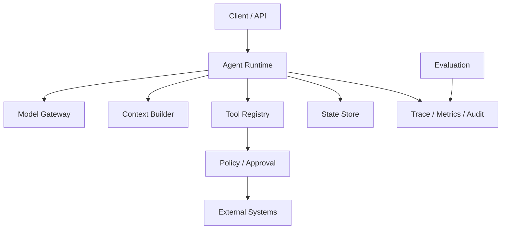

---
tags:
  - architecture
  - MOC
status: seed
---

# Agent 系统架构



## 核心组件

- **Runtime**：控制 [[02-核心机制/07-Agent Loop]]、预算、取消和状态转换。
- **Model Gateway**：统一模型调用、重试、限流和版本信息。
- **Context Builder**：选择指令、记忆、检索结果和工具结果。
- **Tool Registry**：注册 schema、执行器、权限和超时策略。
- **State Store**：保存 run/session 状态，不把模型消息当唯一数据库。
- **Policy/Approval**：每次动作都校验权限，高风险动作还要取得对应批准。
- **Trace/Eval**：让每次决策可观察、可回放、可比较。

## 关键原则

1. 模型输出是不可信输入，必须校验。
2. 业务事实来自源系统，不来自模型记忆。
3. 确定性规则放代码里，模糊判断才交给模型。
4. 模型供应商、工具协议和业务逻辑尽量解耦。
5. 每个 run 都应有明确状态机，而非只保存一串聊天文本。

相关：[[03-工程实践/Context Engineering]] · [[03-工程实践/Tool 设计]] · [[06-评测安全生产/可观测性与生产化]]

## 一次请求的端到端路径

1. API 层完成认证、租户解析、请求大小限制和 run 创建。
2. Runtime 读取任务状态、预算和可用能力。
3. Policy 根据用户和任务筛选工具，而不是把全部工具都交给模型。
4. Context Builder 组装稳定指令、当前状态、相关记忆和外部证据。
5. Model Gateway 调用模型并归一化响应、usage 与错误。
6. Decision Validator 校验结构、状态前置条件和策略。
7. 工具执行或进入人工审批。
8. 观察结果以事件形式写入，再推进下一步。
9. 完成后生成最终结果、引用、运行摘要和审计记录。

> [!example]- 帮助理解：一句“没发货就帮我取消”为什么会经过多层
> | 阶段 | 示例产物 | 这一层解决的问题 |
> | --- | --- | --- |
> | API | `user=u17, tenant=t1, orderInput=A123` | 谁在请求；订单号此时只是待验证输入 |
> | Runtime | `RunCreated(run-9), budget=6 steps` | 任务如何开始、何时必须停 |
> | Policy | 只开放 `get_order` 和 `prepare_cancel` | 本次最多允许做什么 |
> | Model | 提出 `get_order(A123)` | 根据目标选择下一步 |
> | Tool | `status=PAID, shipped=false, version=8` | 从源系统取得当前事实 |
> | Validator | 允许准备取消，但禁止直接写入 | 决定是否满足业务前置条件 |
> | Approval | 展示订单、原因和 action hash | 用户具体批准哪次变更 |
> | Executor | 使用确认令牌和幂等键执行取消 | 同一逻辑动作不重复生效，超时后可查结果 |
> | State Store | 保存读取、批准和执行事件 | 崩溃后从哪里恢复、如何审计 |
>
> 模型可以提出“取消”，但不能替代身份解析、权限、订单事实、确认和幂等。把这些责任分层，不是为了增加组件，而是为了让每个关键决定都有唯一、可测试的负责人。

## 建议的数据模型

```text
Run
  id, userId, tenantId, goal, status
  modelVersion, promptVersion, toolsetVersion
  budget, usage, createdAt, deadline

Step
  id, runId, sequence, type, status
  inputRef, outputRef, startedAt, endedAt

Event
  id, runId, stepId, eventType, payloadRef, occurredAt

Approval
  id, runId, actionHash, requestedBy
  decision, decidedBy, expiresAt
```

大内容可以放对象存储，主表保存引用和哈希；敏感原文应有独立的权限与保留策略。

## 同步还是异步

| 模式 | 适合 | 注意事项 |
| --- | --- | --- |
| 同步 HTTP | 单次问答、短工具调用 | 受代理超时限制 |
| SSE/WebSocket | 需要流式进度和交互 | 断线、重连、事件去重 |
| 队列 + Worker | 长任务、批处理、并发控制 | 状态持久化、取消、幂等 |
| Workflow Engine | 长事务、审批、定时等待 | 与 Agent state 的边界 |

“模型在思考”不是可靠的进度。UI 应展示结构化事件：正在检索、等待审批、工具完成、正在验证等。异步受理、回调和取消竞态见 [[03-工程实践/异步任务与取消]]。

## 控制面与数据面

- **控制面**：Prompt、工具定义、模型路由、策略、评测集和发布配置。
- **数据面**：真实用户请求、模型调用、工具执行和运行状态。

控制面变更需要版本、评测和灰度；数据面每个 run 必须绑定当时的控制面版本，否则无法复现。

## 缓存在哪里安全

- Embedding 可以按模型版本 + 规范化文本缓存。
- 只读工具结果可以按用户/租户/权限和数据版本短期缓存。
- 模型最终回答只有在输入、上下文、权限和版本完全一致时才适合缓存。
- 写工具、审批结果和时间敏感状态不能用普通响应缓存替代源系统。

## 架构评审问题

1. 去掉模型后，哪些确定性组件仍然能独立测试？
2. 任意一步崩溃后，从哪里恢复，是否可能重复副作用？
3. 用户撤销权限后，缓存、Memory 和历史 run 如何处理？
4. Prompt 或工具 schema 升级后，旧 run 能否继续恢复？
5. 能否从最终回答追溯到每个外部证据和动作？

> [!example]- 示例答案（参考）
> 1. Schema 校验、权限策略、预算、状态归并、工具执行器和引用检查都应能脱离模型单测。
> 2. 从最近 checkpoint 恢复；写动作若缺少幂等键或执行结果查询，可能重复副作用。
> 3. 新请求立即停止注入已撤销数据；清理相关缓存和长期 Memory；历史 run 按审计保留策略限制访问，而不是继续用于个性化。
> 4. 旧 run 绑定原 prompt/toolset 版本恢复；若旧版本不可用或 schema 不兼容，则进入迁移或人工处理，不能静默切换。
> 5. 最终结论保存 `sourceRef`，动作保存 step、tool call、审批和结果事件；如果任一关键事实没有引用，应视为评审未通过。

专题：[[03-工程实践/状态、事件与持久化]] · [[03-工程实践/错误恢复与幂等]] · [[03-工程实践/Human-in-the-loop]] · [[03-工程实践/模型网关与路由]] · [[03-工程实践/身份、凭据与委托授权]]
