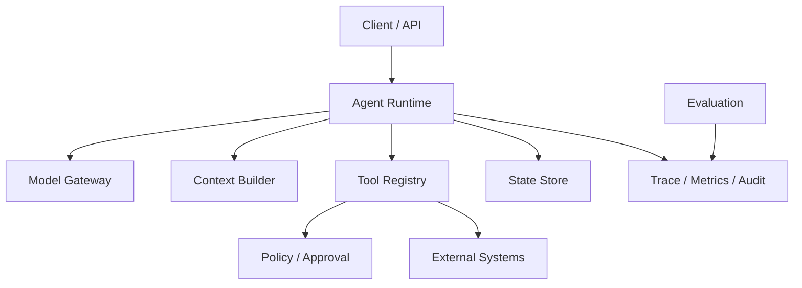

---
tags:
  - architecture
  - MOC
status: seed
---

# Agent 系统架构



## 核心组件

- **Runtime**：控制 [[02-核心机制/07-Agent Loop]]、预算、取消和状态转换。
- **Model Gateway**：统一模型调用、重试、限流和版本信息。
- **Context Builder**：选择指令、记忆、检索结果和工具结果。
- **Tool Registry**：注册 schema、执行器、权限和超时策略。
- **State Store**：保存 run/session 状态，不把模型消息当唯一数据库。
- **Policy/Approval**：在执行高风险动作前独立授权。
- **Trace/Eval**：让每次决策可观察、可回放、可比较。

## 关键原则

1. 模型输出是不可信输入，必须校验。
2. 业务事实来自源系统，不来自模型记忆。
3. 确定性规则放代码里，模糊判断才交给模型。
4. 模型供应商、工具协议和业务逻辑尽量解耦。
5. 每个 run 都应有明确状态机，而非只保存一串聊天文本。

相关：[[03-工程实践/Context Engineering]] · [[03-工程实践/Tool 设计]] · [[06-评测安全生产/可观测性与生产化]]

## 一次请求的端到端路径

1. API 层完成认证、租户解析、请求大小限制和 run 创建。
2. Runtime 读取任务状态、预算和可用能力。
3. Policy 根据用户和任务筛选工具，而不是把全部工具都交给模型。
4. Context Builder 组装稳定指令、当前状态、相关记忆和外部证据。
5. Model Gateway 调用模型并归一化响应、usage 与错误。
6. Decision Validator 校验结构、状态前置条件和策略。
7. 工具执行或进入人工审批。
8. 观察结果以事件形式写入，再推进下一步。
9. 完成后生成最终结果、引用、运行摘要和审计记录。

## 建议的数据模型

```text
Run
  id, userId, tenantId, goal, status
  modelVersion, promptVersion, toolsetVersion
  budget, usage, createdAt, deadline

Step
  id, runId, sequence, type, status
  inputRef, outputRef, startedAt, endedAt

Event
  id, runId, stepId, eventType, payloadRef, occurredAt

Approval
  id, runId, actionHash, requestedBy
  decision, decidedBy, expiresAt
```

大内容可以放对象存储，主表保存引用和哈希；敏感原文应有独立的权限与保留策略。

## 同步还是异步

| 模式 | 适合 | 注意事项 |
| --- | --- | --- |
| 同步 HTTP | 单次问答、短工具调用 | 受代理超时限制 |
| SSE/WebSocket | 需要流式进度和交互 | 断线、重连、事件去重 |
| 队列 + Worker | 长任务、批处理、并发控制 | 状态持久化、取消、幂等 |
| Workflow Engine | 长事务、审批、定时等待 | 与 Agent state 的边界 |

“模型在思考”不是可靠的进度。UI 应展示结构化事件：正在检索、等待审批、工具完成、正在验证等。

## 控制面与数据面

- **控制面**：Prompt、工具定义、模型路由、策略、评测集和发布配置。
- **数据面**：真实用户请求、模型调用、工具执行和运行状态。

控制面变更需要版本、评测和灰度；数据面每个 run 必须绑定当时的控制面版本，否则无法复现。

## 缓存在哪里安全

- Embedding 可以按模型版本 + 规范化文本缓存。
- 只读工具结果可以按用户/租户/权限和数据版本短期缓存。
- 模型最终回答只有在输入、上下文、权限和版本完全一致时才适合缓存。
- 写工具、审批结果和时间敏感状态不能用普通响应缓存替代源系统。

## 架构评审问题

1. 去掉模型后，哪些确定性组件仍然能独立测试？
2. 任意一步崩溃后，从哪里恢复，是否可能重复副作用？
3. 用户撤销权限后，缓存、Memory 和历史 run 如何处理？
4. Prompt 或工具 schema 升级后，旧 run 能否继续恢复？
5. 能否从最终回答追溯到每个外部证据和动作？

专题：[[03-工程实践/状态、事件与持久化]] · [[03-工程实践/错误恢复与幂等]] · [[03-工程实践/Human-in-the-loop]] · [[03-工程实践/模型网关与路由]]
