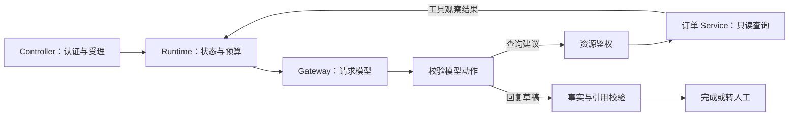

---
tags:
  - engineering
  - typescript
  - java
status: seed
---

# TypeScript 与 Java 实现对照

如果你平时写 Node.js（TypeScript）和 Java 后端，可以直接用这些经验学习 Agent，**不需要先学 Python**。先从 [[labs/01-agent-runtime/README|离线 Runtime 实验的 TypeScript 入口]] 开始，再按现有业务所属的技术栈实现项目。

> [!tip] 本页学习目标
> 看完能把模型接入放到合适的代码层，区分“类型正确”和“业务可执行”，并理解异步调用为什么还需要取消、预算和状态管理。
> 前置：[[02-核心机制/04-Tool Calling]]。下面代码只演示接口与动作校验，不包含供应商 SDK、完整消息协议或可上线的 Runtime；可运行实验见上方链接。

## 用熟悉的后端分层理解 Agent

假设用户说：“帮我查 ORD-001 为什么还没发货。”你已经熟悉“Controller 收请求 → Service 查订单 → 返回 DTO”；Agent 额外让模型提出下一步，再由业务代码检查能不能做。

| 你熟悉的概念 | Agent 中对应什么 | 哪些责任仍然属于程序 |
| --- | --- | --- |
| Controller / Route Handler | 接收目标、创建 run | 认证、请求大小、注入可信用户和租户 |
| Application Service | Agent Runtime | 决策循环、步数/费用预算、取消、失败与终止状态 |
| HTTP Client / SDK Adapter | Model Gateway | 供应商协议、消息与 tool call ID、usage、错误归一化 |
| DTO + 参数校验 | Decision / Tool Contract | 验证模型返回的字段、类型、枚举和额外字段 |
| Domain Service | 工具执行器和业务规则 | 订单归属、当前状态、金额、审批、事务和幂等 |
| Repository / Event Log | Run Store / Trace | 记录当前状态、实际动作及可追溯证据 |



模型说“查这个订单”，相当于提交了一张查询申请。`tenantId` 来自登录身份，不应让模型填写；订单 Service 仍需确认该租户能访问这张订单。Runtime 还要检查它是不是本次任务要求的订单：查 ORD-001 时不能因有权读取 ORD-002 就改答后者。模型说“已完成”也只是一种建议，最终状态由 Runtime 根据验收结果决定。

## TypeScript：模型输出先当作 unknown

`as Decision` 是告诉编译器“相信我”，不会检查外部 JSON。先解析为 `unknown`，校验后再得到可安全分支的联合类型；这是 TypeScript 的类型收窄用途。[官方类型断言说明](https://www.typescriptlang.org/docs/handbook/2/everyday-types.html#type-assertions)、[联合类型与收窄](https://www.typescriptlang.org/docs/handbook/2/narrowing.html#discriminated-unions)。

```typescript
type Decision =
  | { type: "tool_call"; name: "get_order_status"; arguments: { order_id: string } }
  | { type: "final"; text: string };

type ExecutionContext = Readonly<{
  tenantId: string; // 来自服务端已验证的身份
  runId: string;
  signal: AbortSignal;
}>;

interface ModelGateway {
  // 适配器内部负责维护供应商要求的消息历史与工具调用 ID。
  next(goal: string, observation: unknown, signal: AbortSignal): Promise<unknown>;
}

function isObject(value: unknown): value is Record<string, unknown> {
  return typeof value === "object" && value !== null && !Array.isArray(value);
}

function hasOnly(value: Record<string, unknown>, keys: string[]): boolean {
  return Object.keys(value).length === keys.length &&
    keys.every(key => Object.prototype.hasOwnProperty.call(value, key));
}

function parseDecision(raw: unknown): Decision {
  if (!isObject(raw)) throw new Error("INVALID_ACTION");
  if (raw.type === "final" && hasOnly(raw, ["type", "text"]) &&
      typeof raw.text === "string" && raw.text.trim().length > 0) {
    return { type: "final", text: raw.text };
  }
  if (raw.type === "tool_call" && hasOnly(raw, ["type", "name", "arguments"]) &&
      raw.name === "get_order_status" && isObject(raw.arguments) &&
      hasOnly(raw.arguments, ["order_id"]) &&
      typeof raw.arguments.order_id === "string" &&
      /^ORD-[0-9]{3}$/.test(raw.arguments.order_id)) {
    return { type: "tool_call", name: "get_order_status",
      arguments: { order_id: raw.arguments.order_id } };
  }
  throw new Error("INVALID_ACTION");
}

function nextStage(action: Decision): string {
  switch (action.type) {
    case "tool_call": return `先鉴权，再查询 ${action.arguments.order_id}`;
    case "final": return "交给事实与引用校验，尚不能直接标记 completed";
  }
}
```

这里没有用类型断言跳过校验：额外的 `tenant_id`、数字订单号、未知工具名都会被拒绝。`nextStage` 只展示分支，**没有执行工具，也没有验证订单归属或回答真实性**。`parseDecision` 抛错后，应由 Runtime 捕获、记录稳定错误码并有限修复或终止，而不是让整批评测中断。

模型动作通常比这更复杂，但先把一个窄工具做对即可。统一工单分类输出是另一份契约，见 [[01-基础/02-Prompt 与结构化输出#工单分类契约]]；不要把工具参数和分类 DTO 混在一起。

## Java：反序列化成对象后，仍要校验动作

Java 可以用 `record` 表示数据，用 `sealed interface` 限定动作种类。下面是 Java 17+ 的普通语言特性；使用 `instanceof` 分支，不需要启用预览特性。模型 JSON 先由适配器解析为 `Map` 等普通对象，再交给 `parseDecision(Object)`；JSON 文本本身不是这个方法的输入。

```java
import java.util.Map;
import java.util.Set;
import java.util.concurrent.CompletableFuture;

public final class ActionContract {
    sealed interface Decision permits ReadOrder, FinalAnswer {}
    record ReadOrder(String orderId) implements Decision {}
    record FinalAnswer(String text) implements Decision {}

    interface CancellationToken { boolean isCancelled(); }
    record ExecutionContext(String tenantId, String runId,
                            CancellationToken cancellation) {}
    interface ModelGateway {
        CompletableFuture<Object> next(String goal, Object observation,
                                       CancellationToken cancellation);
    }

    static Decision parseDecision(Object raw) {
        if (!(raw instanceof Map<?, ?> action)) {
            throw new IllegalArgumentException("INVALID_ACTION");
        }
        if ("final".equals(action.get("type"))
                && action.keySet().equals(Set.of("type", "text"))
                && action.get("text") instanceof String text && !text.isBlank()) {
            return new FinalAnswer(text);
        }
        if ("tool_call".equals(action.get("type"))
                && action.keySet().equals(Set.of("type", "name", "arguments"))
                && "get_order_status".equals(action.get("name"))
                && action.get("arguments") instanceof Map<?, ?> args
                && args.keySet().equals(Set.of("order_id"))
                && args.get("order_id") instanceof String orderId
                && orderId.matches("ORD-[0-9]{3}")) {
            return new ReadOrder(orderId);
        }
        throw new IllegalArgumentException("INVALID_ACTION");
    }

    static String nextStage(Decision action) {
        if (action instanceof ReadOrder read) {
            return "先鉴权，再查询 " + read.orderId();
        }
        if (action instanceof FinalAnswer) {
            return "交给事实与引用校验，尚不能直接标记 completed";
        }
        throw new IllegalArgumentException("INVALID_ACTION");
    }
}
```

这段代码可放进 `ActionContract.java` 编译，但没有 `main`、HTTP 服务或真实模型实现。`ReadOrder` 构造器只是建 DTO，不会自动检查权限；只有经过校验的外部输入才能进入动作分支。`CancellationToken` 也是自定义接口，实际实现需要在线程间安全地传递取消状态，并由工作线程和 I/O 适配器配合检查。

## Schema、语言类型、Bean Validation 各检查什么

| 层次 | 能回答什么 | 不能自动保证什么 |
| --- | --- | --- |
| TypeScript 类型 / Java DTO、record | 业务代码预期哪些字段和动作类型 | 外部输入真的符合类型；record 的字符串非空或订单归属正确 |
| 运行时 schema / 上面的显式校验 | JSON 形状、必填字段、类型、枚举、额外字段 | 当前用户有权读取；订单现在允许取消 |
| Java Bean Validation | 执行校验时检查声明的字段/对象约束 | 仅写注解就触发所有场景的校验；自动拒绝反序列化时被忽略的未知字段 |
| 业务 Service / Policy | 结合真实身份与状态检查权限和业务条件 | 模型生成的自然语言必然真实、完整 |

Bean Validation 需要通过校验器或已配置的框架集成触发；跨字段规则可以声明为类级约束，但实时订单状态和权限通常仍需业务代码查询。未知 JSON 字段是在反序列化或 schema 阶段处理，不能指望 DTO 上的非空注解发现它。[Jakarta Bean Validation 官方规范](https://jakarta.ee/specifications/bean-validation/3.0/jakarta-bean-validation-spec-3.0.html)。

> [!example]- 帮助理解：两个语言中同一条坏输入
> `{"type":"tool_call","name":"get_order_status","arguments":{"order_id":"ORD-001","tenant_id":"other"}}`
>
> 两段 `parseDecision` 都应拒绝它，因为工具参数只能包含 `order_id`。删除额外字段之后，schema 可以通过；但如果 ORD-001 属于别的租户，后续的资源鉴权仍必须拒绝。两个检查解决的是两个不同问题。

## Promise 与 CompletableFuture：等待结果不等于控制任务

`Promise<T>` 和 `CompletableFuture<T>` 都可以表示“稍后得到结果或错误”。它们帮助组织异步流程，但 Agent 还要知道当前是否超时、是否取消、执行到哪一步以及是否已产生副作用。

| 场景 | Node.js / TypeScript | Java |
| --- | --- | --- |
| 等待模型或工具 | `await` 一个 Promise | 组合 `CompletableFuture`，或在受控执行线程中等待 |
| 告诉下游停止 | 传递 `AbortSignal` 给支持它的 I/O API | 传递取消标志、deadline，并调用具体客户端支持的取消机制 |
| 决策后、执行前取消 | Runtime 再检查信号，停止派发工具 | Runtime 再检查 token，停止派发工具 |
| 已经发出的业务写入 | 查询源系统结果；不能假设取消已撤回 | 同样查询结果，并使用幂等和对账 |

Node 的 `AbortController` 会发出取消信号，只有支持它、且收到该 signal 的操作才会响应；`Promise.race` 里放一个超时 Promise，只会让等待先结束，不会自动停止另一个操作。[Node.js AbortController 文档](https://nodejs.org/api/globals.html#class-abortcontroller)。

对于普通 `CompletableFuture`，`cancel(true)` 中的 `true` 也不表示一定中断底层线程；其默认实现不靠线程中断控制计算。`orTimeout` 可以让 Future 以超时异常结束，也不能据此推断远端请求未执行。具体客户端可能提供额外取消行为，需要核对并做集成测试。[Java 17 CompletableFuture 文档](https://docs.oracle.com/en/java/javase/17/docs/api/java.base/java/util/concurrent/CompletableFuture.html#cancel(boolean))。

例如查询订单超时，Runtime 可以有限重试；如果以后增加退款工具，超时意味着“本地没有及时拿到结果”，下一步应查询这笔退款是否已生效。详见 [[03-工程实践/异步任务与取消]]、[[03-工程实践/错误恢复与幂等]]。

## 选哪种语言，以及 Spring AI 放哪一层

- **已有 Node.js/TypeScript 服务**：直接在熟悉的项目里增加 Gateway、Runtime 和只读工具；本仓库的 TypeScript 离线实验是默认起点。
- **已有 Java/Spring 服务**：沿用 Controller、Service、鉴权和数据访问层；先掌握上面的边界，再通过 [[04-框架与生态/Spring AI 能力边界|Spring AI]] 接模型、工具或检索能力。
- **两种都会、尚无业务约束**：先选一种把四个项目的基础级跑通。只有现有系统边界或团队分工确实需要时，才拆成跨语言服务；学习 Agent 不要求同时部署 TS 与 Java 两套服务。

Spring AI 可以帮助适配模型协议和工具调用，业务 Runtime 仍决定预算、暂停/恢复、审批和最终状态。如果选择框架自动驱动工具循环，要确认每次执行都经过你的策略边界；自行编排复杂流程时，也要避免“外层 Runtime 循环 + 内层隐藏自动循环”造成步数和审批失控。具体行为按项目锁定版本核对上面的 Spring AI 专题。

## 3 个小练习

1. 为什么 `JSON.parse(text) as Decision` 和“反序列化成 Java record 成功”都不足以允许工具执行？
2. 用户点击取消时，订单查询已经发出，但回复还没回来。两种语言分别要做什么？
3. 已有 Java 订单服务，你想学习 Agent，是否应该先新建一个 Python 服务，再用 Node 做网关？

> [!example]- 示例答案（参考）
> 1. 先做运行时结构与业务校验，再按服务端身份鉴权。类型声明不是授权证明，额外字段或被强制转换的值也需要明确处理。
> 2. 记录取消请求，向下游传递支持的取消信号或客户端取消调用，停止后续动作；记录实际结束状态。若操作可能产生副作用，还要查询源系统结果，不能把本地取消当作业务回滚。
> 3. 不需要。可以在现有 Java 边界内接入；也可先跑 TypeScript 离线实验理解机制。选择依据是现有代码和团队维护成本，而不是教程示例恰好用哪种语言。

相关：[[03-工程实践/Agent 系统架构]] · [[03-工程实践/Tool 设计]] · [[05-项目实战/项目总览]]
