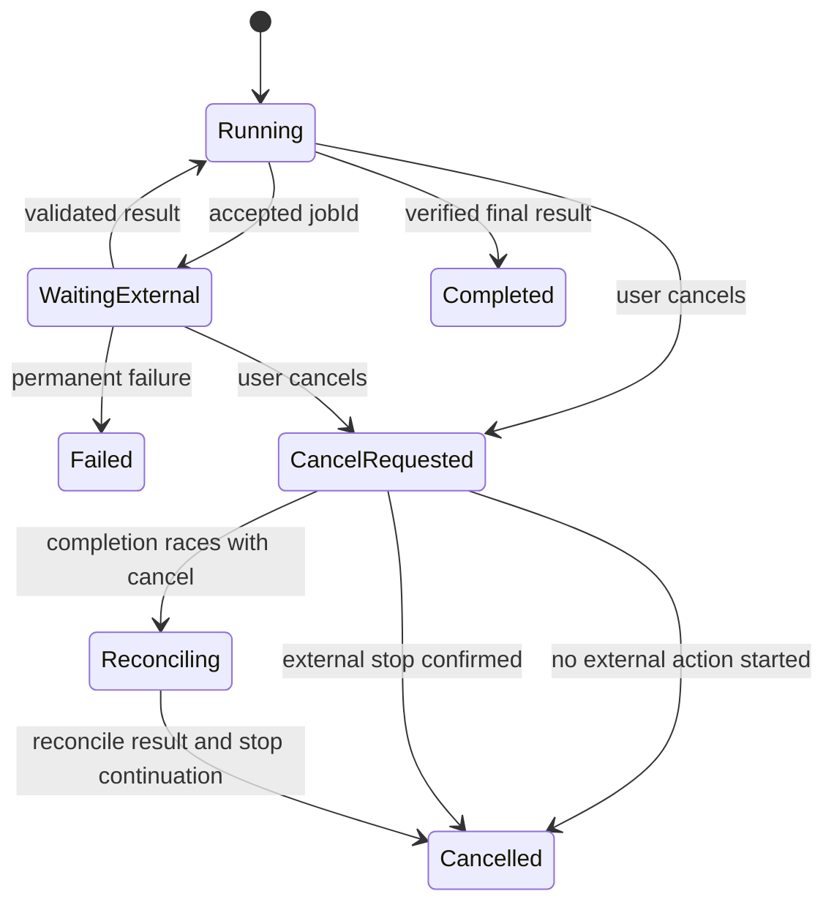

---
tags:
  - engineering/runtime
  - engineering/reliability
---

# 异步任务与取消

前置：[[02-核心机制/07-Agent Loop]]、[[03-工程实践/状态、事件与持久化]]。本章用“生成一份大报表”解释：工具不能立刻返回时，Agent 怎样等、怎样继续、怎样停止。

## 点菜小票和真正上菜

同步调用像在窗口等一杯咖啡：请求一直等到拿到结果。异步调用像拿到取餐号：服务先回复“已受理，任务 J7”，稍后才能取结果。

`accepted`、`HTTP 202` 或 `jobId` 只表示受理，不能向用户说“报表已完成”。流式进度也只是一种传输方式，不自动提供任务持久化。

## 最小任务契约

```text
start_report(params, idempotencyKey) -> {jobId, status: QUEUED}
get_report_job(jobId) -> {status, progress, resultRef, error}
cancel_report_job(jobId) -> {cancellationRequested: true}
```

这些是本教程的业务接口示意，不是某个框架或协议的固定方法名。

Run 保存整体目标；Tool Call 保存一次逻辑调用；Job 保存外部异步任务。用 `runId/callId/jobId` 关联，不能仅用“最近一个任务”寻找回调归属。

## 三个角色各自保存什么

| 角色 | 持久化内容 | 为什么需要 |
| --- | --- | --- |
| Runtime | 待处理 call ID、deadline、任务状态版本 | 恢复后知道在等什么 |
| 外部 Worker | job 状态、处理进度、结果引用 | 浏览器关闭后仍能查询 |
| 事件接收器 | 已处理 event ID、回调验证结果 | 防止重复或伪造结果 |



图中 `Cancelled` 表示本次 Agent 不再继续工作。尚未发出的动作可以直接停止；已经发出的动作需要确认停止或核对真实结果。外部结果另存 `jobStatus`，不能用取消状态抹掉真实副作用。

## 走一遍乱序与重复

1. Run R1 提交 C1，拿到 J7，进入 `WAITING_EXTERNAL`。
2. Worker 发送 `event=e10, jobVersion=2, RUNNING`；系统记录进度。
3. Worker 发送 `event=e11, jobVersion=3, COMPLETED`；系统验证来源、归属、结果，再恢复一次。
4. 网络重试再次送来 e11；按 event ID 去重，不再次恢复。
5. 旧的 e10 晚到；已知版本 3，不能退回 RUNNING。

没有单调版本号的供应商，遇到冲突应查 job 当前状态，不能仅凭本机收到消息的先后顺序推断业务顺序。回调还需按供应商约定验签并防重放；`jobId` 本身不是权限证明。

去重表本身还不够：若“记下 e11”后、恢复任务前进程崩溃，单纯忽略重复消息会永远丢掉恢复。应把事件入库、状态版本推进和待恢复任务写入放进同一事务，或用事务 outbox 可靠交接；消费者仍需幂等。通俗地说，既要在小票上盖“已收”，也要可靠地把“该叫号了”交给下一位工作人员。

## 取消为什么不是立即成功

> [!example]- 帮助理解：点击取消时邮件已经发出
> 10:00:00 用户点击取消，10:00:01 Runtime 发出取消请求，邮件系统却在 09:59:59 已发送成功。此时正确记录是“Agent 停止后续处理；外部邮件已发送”，不能记录为“邮件未发送”。是否发更正邮件是新的业务动作，需要新的授权。

执行前用状态版本或事务确认任务仍可执行；执行后仍需处理取消与成功竞态。超过 deadline 的结果可以留作审计，但不能自动触发已过期任务的下一步。用户修改目标时增加 `goalVersion`，旧目标的迟到结果不能直接驱动新动作。

## 并行与部分成功

订单查询和政策读取互不依赖时可以同时执行；等待汇合时，事先定义哪些结果必需、哪些可缺。两个结果中缺一个，若无法支持结论，就返回部分结果与限制，不能把成功的一半冒充完整报告。

多 Worker 通过有到期时间的 lease 领取任务，心跳延长租约；租约过期只说明可以重新领取，不说明第一次执行一定停止。关键写入仍靠幂等键或 fencing/version 检查防止旧 Worker 重复生效。

## 三条验收题

1. 成功回调重复三次，应恢复模型几次？
2. 任务取消后，迟到的报表能否自动发给客户？
3. Worker 租约过期，能否直接用新幂等键重做支付？

> [!example]- 示例答案（参考）
> 1. 同一完成结果逻辑上只推进一次；消息或恢复尝试可能重复投递，靠事务交接、版本检查与幂等消费防止重复推进，不能只靠去重表宣称 exactly-once。2. 不能自动发送；记录外部完成，保持取消决定。3. 不能；查询并复用同一逻辑支付的幂等结果，未知时进入核对流程。

先在内存 fake tool 中模拟这些事件顺序，再接消息队列。真正的数据库、签名、并发事务和外部取消语义需要集成测试。

相关：[[03-工程实践/错误恢复与幂等]] · [[03-工程实践/Agent 系统架构]] · [[06-评测安全生产/可观测性与生产化]]
