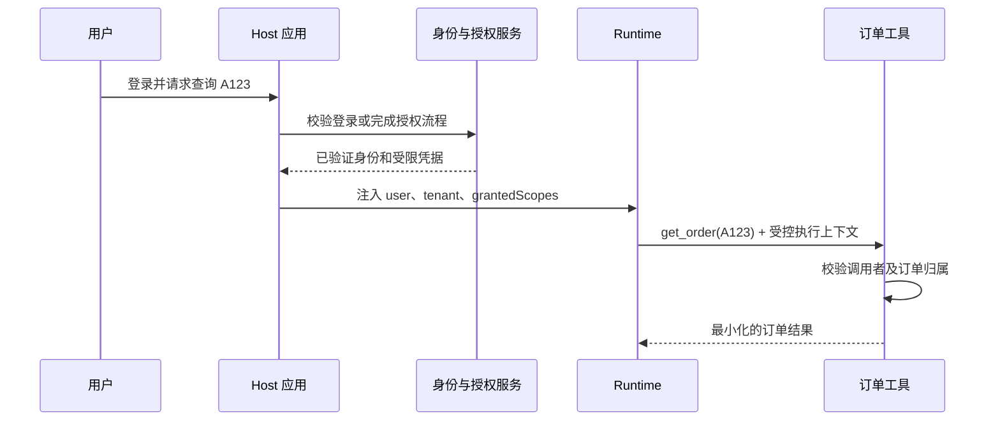

---
tags:
  - engineering/identity
  - security
verified: 2026-09-05
---

# 身份、凭据与委托授权

本章补上 [[03-工程实践/Tool 设计]] 中“Runtime 注入身份”的前半段：身份从哪里来，Agent 怎样代表用户做事。读完应能区分登录、接口授权和一次动作的批准。

## 先用门禁理解

假设小林在商家 A 做客服，让助手查询订单 A123。登录像前台核验工牌；access token 像一张有使用范围和有效期的门禁卡；订单鉴权则是门内的档案管理员检查“这份资料是否归你管理”。

| 问题 | 谁来回答 | 常见机制 |
| --- | --- | --- |
| 你是谁 | 认证系统 | 登录会话、OIDC |
| 应用能代表你访问什么服务 | 授权服务器 | OAuth access token、scope |
| 你能否读这张订单 | 订单服务 | 租户、归属、角色、业务条件 |
| 你是否批准这次取消 | 审批服务 | 具体参数、有效期、action hash |

“用户已登录”只回答了第一行。“用户点了同意”也不代表应用获得所有商家的订单权限。

## 从登录到一次工具调用



模型只需要给出 `orderNumber=A123`，不负责填写 `userId`、租户、令牌或 scope。身份来自经过验证的登录/令牌及服务端映射，而不是用户正文中的“我是管理员”。

## 几个容易混淆的词

| 名称 | 通俗含义 | 不代表什么 |
| --- | --- | --- |
| ID token | 向客户端表达一次已认证身份的信息 | 不能随意拿来调用业务 API |
| Access token | 访问目标资源服务器的凭据 | 不一定是 JWT，也不是模型参数 |
| Refresh token | 在授权仍有效时换取新 access token | 不会扩大原授权，也不应给模型 |
| scope | 允许的一类动作，如 `orders:read` | 不证明 A123 属于当前租户 |
| audience / resource | 凭据是发给哪个服务使用的 | 发给订单服务的卡不能刷支付服务 |
| PKCE | 把授权码的兑换绑定到发起流程的客户端 | 不取代登录、授权或资源鉴权 |

OIDC 在 OAuth 2.0 基础上定义身份认证；OAuth 主要解决授权访问。实际验证需使用成熟库，检查签发者、受众、有效期和相应签名/令牌有效性，不要只 Base64 解码后相信字段。[OIDC Core](https://openid.net/specs/openid-connect-core-1_0.html)、[OAuth 安全最佳实践](https://www.rfc-editor.org/rfc/rfc9700)

## 两种执行身份

- **代表用户**：只在用户授权与应用策略的交集中行动；用户离职或撤销权限后，后续操作要重新判断。
- **服务身份**：后台定时任务使用专门服务账号。记录它代表哪个业务任务行动，不能伪装成人类用户，也不能把拥有的大权限自动给模型使用。

> [!example]- 帮助理解：服务账号权限很大，用户权限仍很小
> 订单适配器技术上可访问所有商家的 API，但小林仅属于商家 A。Runtime 应先把请求绑定到 A，工具再检查订单归属。模型把订单号改成商家 B 的订单时应拒绝，不能因为适配器的服务账号读得到就放行。这类“借用高权限代理完成低权限用户不能做的事”的问题常叫 confused deputy。

## 远程 MCP 的一跳与下一跳

启用 HTTP 授权的 MCP Server 是一个受保护资源。Client 通过资源元数据找到授权服务，为目标 Server 请求凭据；每次受保护请求携带正确令牌。Server 必须验证令牌是发给自己的，不能接收或直接透传其他服务的 token。[MCP 2026-07-28 Authorization](https://modelcontextprotocol.io/specification/2026-07-28/basic/authorization)

```text
Host -- token for MCP --> MCP Server -- 独立的下游授权 --> 订单 API
```

第二跳可以使用按策略选择的服务凭据，或授权平台支持的委托/令牌交换方案；具体取决于下游系统。不能简单把第一跳的 bearer token 原样复制过去。stdio 本地工具则主要依赖进程、文件和环境权限，边界不同。

## 过期、撤销与审批

凭据过期可走已授权的刷新流程；刷新失败应要求重新连接。权限撤销后，新的工具调用和旧任务恢复都要重新校验，并失效相关权限缓存。删除 token 不能撤回已经发出的邮件；审批也不能保证外部动作尚未发生，仍需 [[03-工程实践/错误恢复与幂等]] 的结果核对。

## 10 分钟练习

小林有 `orders:read`，模型请求读取 B 商家的订单；另一请求读取 A 商家订单但 access token 已过期。分别由哪一层处理？

> [!example]- 示例答案（参考）
> 第一种由资源鉴权拒绝，不泄露订单内容；第二种在认证/适配层按既有授权刷新或返回重新登录。两者都不能通过“让模型再试一次”解决，也不要把 token 发给模型排错。

关联：[[06-评测安全生产/安全与权限]] · [[04-框架与生态/MCP 概览]] · [[03-工程实践/Human-in-the-loop]]
