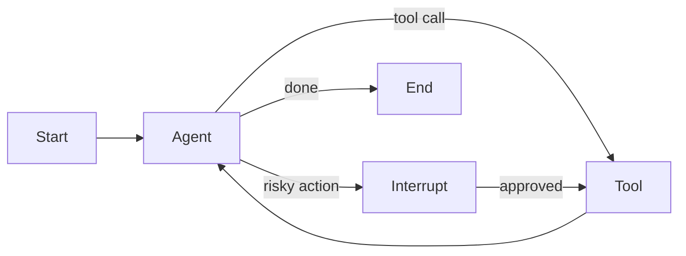

---
tags:
  - ecosystem/langgraph
status: seed
---

# LangGraph 概览

LangGraph 的核心思路是把 Agent 表达成“状态 + 节点 + 边”的图。节点执行模型或工具，边决定下一步，检查点用于暂停、恢复和人工介入。

本教程优先链接 JavaScript/TypeScript 版本，Node.js 开发者不需要转学 Python。先手写 [[labs/01-agent-runtime/README|TypeScript 离线循环]]，再看框架怎样接管节点调度；Java 项目可以继续用业务 Workflow 或按需评估 [[04-框架与生态/Spring AI 能力边界]]，无需强行统一语言。

## 适合场景

- 多步流程有循环和条件分支。
- 需要持久化状态、失败恢复或 human-in-the-loop。
- 希望清晰观察每个节点，而不是把流程藏在一个长 Prompt 中。

## 学习重点

不要只记 API。先理解 [[03-工程实践/Workflow 与 Agent]]、状态归并、节点幂等、终止条件和错误边。框架更新时这些设计仍然有效。

## 不必使用的场景

一次模型调用、固定的三步流水线或简单工具路由，普通代码更直接。

相关：[[02-核心机制/07-Agent Loop]] · [[03-工程实践/Agent 系统架构]]

## 核心模型

LangGraph 把应用表示为：

- **State**：节点之间共享的显式数据。
- **Node**：读取状态并返回状态更新的执行单元。
- **Edge**：固定或条件化的路由。
- **Checkpointer**：按 thread 保存每一步状态快照。
- **Interrupt**：暂停图，等待人工输入后恢复。



## Durable Execution

官方文档将 LangGraph 定位为面向长运行、有状态 Agent 的低层编排 runtime，重点能力包括 durable execution、streaming、human-in-the-loop 和 persistence。使用 checkpointer 后，图状态按 step 保存，可用于恢复、调试和人工审批。

Checkpoint 不能自动解决副作用幂等。节点恢复后是否重跑、外部写操作是否已发生，仍需要 [[03-工程实践/错误恢复与幂等]] 中的业务设计。

> [!example]- 帮助理解：有 checkpoint，为什么仍可能重复扣款
> 1. 图在“准备扣款”后保存 checkpoint。
> 2. 扣款节点调用支付系统，支付成功。
> 3. 进程在写入下一个 checkpoint 前崩溃。
> 4. 恢复后，图只看得到“准备扣款”的旧状态，可能再次执行扣款节点。
>
> Checkpoint 解决的是“图从哪个状态继续”，不是“外部世界是否已经发生副作用”。正确做法是为这次逻辑扣款生成幂等键，并在重试和恢复中稳定复用；支付系统还应把它与调用主体及规范化业务参数绑定。恢复时先查询该键对应的执行结果，再决定复用结果还是重试。

## Graph 设计原则

- 节点尽量小而有明确输入输出，但不要把每行代码都拆成节点。
- State 保存业务状态，不只保存 messages。
- 条件边返回有限枚举，避免自由文本路由。
- 写节点应幂等，或在执行前后记录动作状态。
- Interrupt 前持久化真实待审参数，恢复时重新校验。
- `interrupt()` 恢复时会从当前节点开头重新执行；放在 interrupt 之前的副作用必须幂等。同一节点有多个 interrupt 时，每次重执行的数量与顺序必须稳定，因为恢复值按位置匹配。

## 与 LangChain 的关系

按照当前官方定位，LangGraph 是低层编排 runtime；LangChain 提供更高层的 Agent 抽象和集成。可以在 LangGraph 中使用 LangChain 组件，但并非必须。学习时应先理解图和状态，再决定是否采用预构建 Agent。

## 最小练习

实现一个三节点图：分类问题 → 只读查询 → 生成回答。再加入：查询失败重试一次、敏感查询 interrupt、checkpoint 后恢复。用同一 thread ID 验证状态是否连续。

> [!example]- 示例答案（伪代码）
> ```text
> classify -> normal: query -> answer -> END
>          -> sensitive: interrupt -> approved: query
>                                -> rejected: END
> query -> retryable_error: retry_query(max=1)
>       -> permanent_error: answer_with_failure
> ```
> State 至少包含 `category/queryResult/retryCount/pendingApproval/status`；thread ID 放在 checkpointer 的运行配置中，避免出现两个真相源。恢复测试中，interrupt 前后使用同一 thread ID，确认 `retryCount` 和分类结果没有丢失；查询工具仍应使用幂等或只读语义，不能把 checkpoint 当作副作用保障。

## 官方资料

- [LangGraph JavaScript/TypeScript Overview](https://docs.langchain.com/oss/javascript/langgraph/overview)
- [Graph API](https://docs.langchain.com/oss/javascript/langgraph/graph-api)
- [Persistence](https://docs.langchain.com/oss/javascript/langgraph/persistence)
- [Interrupts](https://docs.langchain.com/oss/javascript/langgraph/interrupts)

JavaScript/TypeScript 资料及 interrupt 恢复语义核对日期：2026-09-05。
