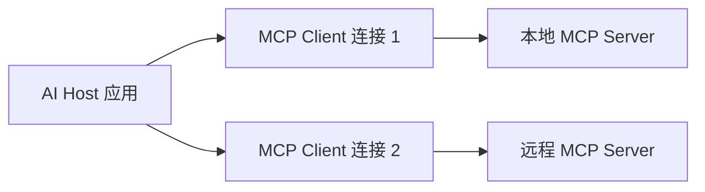

---
aliases:
  - Model Context Protocol
tags:
  - ecosystem/mcp
status: seed
---

# MCP 概览

MCP（Model Context Protocol）为 AI 应用发现和调用外部能力提供统一协议。它能暴露 tools、resources 和 prompts，但不会自动赋予 Agent 业务权限。

## 可以解决

- 让不同客户端用统一方式发现工具。
- 把资源读取、工具执行与模型供应商解耦。
- 降低每个客户端重复写集成适配的成本。

## 不能替代

- 业务身份认证与资源授权
- 工具内部的参数校验和审计
- [[02-核心机制/07-Agent Loop]] 的规划与终止策略
- [[06-评测安全生产/Agent 评测]] 和安全治理

## 设计视角

MCP Server 是能力边界，不是“把整个后端暴露出去”。优先暴露窄而稳定的业务工具和只读资源；破坏性操作仍需独立审批。

相关：[[02-核心机制/04-Tool Calling]] · [[03-工程实践/Tool 设计]]

## Host、Client 与 Server



Host 管理用户体验、模型和整体权限；每个 Client 与一个 Server 维护协议连接；Server 暴露有限能力。一个 Host 可以连接多个 Server，但不应把不同 Server 的权限上下文混在一起。

## 两层协议

- **Data layer**：基于 JSON-RPC 的生命周期、能力协商、tools/resources/prompts 和通知。
- **Transport layer**：负责连接、消息分帧和通信；官方架构说明包括本地 stdio 与远程 Streamable HTTP。

初始化时双方协商协议版本和 capabilities。不能因为某个 Server 名称相同就假设它支持相同能力。

## 三个核心 Server primitives

| Primitive | 控制主体 | 适合内容 |
| --- | --- | --- |
| Tools | 模型/Host 决定调用，Host 执行策略 | 查询或动作 |
| Resources | Host/用户选择读取 | 文件、记录、schema 等上下文数据 |
| Prompts | 用户或 Host 选择 | 可复用交互模板 |

Resources 适合“读取数据”，Tools 适合“执行有参数的能力”。不要把每个静态文档都包装成工具。

## 一个工具定义示意

```json
{
  "name": "get_order_status",
  "description": "Read current order status; no mutation",
  "inputSchema": {
    "type": "object",
    "properties": {
      "orderNumber": {"type": "string"}
    },
    "required": ["orderNumber"]
  }
}
```

协议 schema 只是第一层。Server 仍要根据真实调用者验证租户、scope 和资源权限。

## 本地与远程边界

- stdio Server 由 Host 启动，适合本机文件或开发工具；要防止进程继承过多环境变量和文件权限。
- 远程 Server 需要网络认证、授权、TLS、限流和租户隔离。
- 不应把本地 Server 当成天然可信，也不应把访问令牌放进模型参数。

## 安全检查

1. 工具集合是否遵循最小能力？
2. Host 是否在调用前显示敏感动作？
3. Server 是否逐工具/逐资源验证 scope？
4. 日志是否避免记录令牌和敏感工具结果？
5. Server 更新工具定义时，Host 是否重新评估权限？
6. 第三方 Server 是否经过来源和供应链审查？

## 官方资料

- [MCP Architecture Overview](https://modelcontextprotocol.io/docs/learn/architecture)
- [MCP Authorization 教程](https://modelcontextprotocol.io/docs/tutorials/security/authorization)

资料核对日期：2026-07-14。
