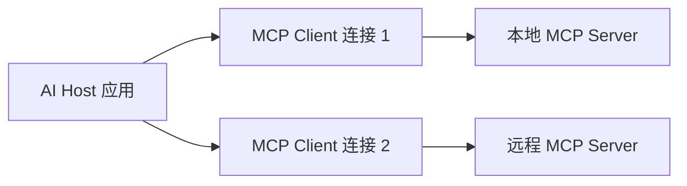

---
aliases:
  - Model Context Protocol
tags:
  - ecosystem/mcp
status: seed
---

# MCP 概览

MCP（Model Context Protocol）为 AI 应用发现和调用外部能力提供统一协议。它能暴露 tools、resources 和 prompts，但不会自动赋予 Agent 业务权限。

可以把它理解为“统一插头”：Host 不必为每个外部系统重新发明连接格式；但插头能插上，不代表当前用户已经拿到房门钥匙。身份、授权、审批和业务规则仍由应用与 Server 负责。

## 可以解决

- 让不同客户端用统一方式发现工具。
- 把资源读取、工具执行与模型供应商解耦。
- 降低每个客户端重复写集成适配的成本。

## 不能替代

- 业务身份认证与资源授权
- 工具内部的参数校验和审计
- [[02-核心机制/07-Agent Loop]] 的规划与终止策略
- [[06-评测安全生产/Agent 评测]] 和安全治理

## 设计视角

MCP Server 是能力边界，不是“把整个后端暴露出去”。优先暴露窄而稳定的业务工具和只读资源；破坏性操作仍需独立审批。

相关：[[02-核心机制/04-Tool Calling]] · [[03-工程实践/Tool 设计]]

## Host、Client 与 Server



Host 管理用户体验、模型和整体权限；每个 Client 与一个 Server 维护协议连接；Server 暴露有限能力。一个 Host 可以连接多个 Server，但不应把不同 Server 的权限上下文混在一起。

> [!example]- 帮助理解：发现工具不等于获得授权
> ```mermaid
> sequenceDiagram
>     participant H as Host
>     participant C as MCP Client
>     participant S as MCP Server
>     participant M as 模型
>     H->>C: 为该 Server 建立一个 Client
>     C->>S: server/discover（可选预发现）
>     S-->>C: 支持的版本、能力与身份
>     C->>S: tools/list + 每请求 _meta
>     S-->>C: 工具定义 + 缓存提示
>     H->>H: 按用户权限筛选可见工具
>     H->>M: 消息 + 可见工具
>     M-->>H: 提出 tool call
>     H->>H: 校验参数 / 必要时确认
>     H->>C: tools/call
>     C->>S: 调用并携带受控身份上下文
>     S-->>C: 鉴权后的结构化结果
>     H->>M: 回填工具结果
> ```
> 模型通常不直接连接 Server。Host 能列出一个工具，只说明“知道它存在”；是否允许本次执行，仍要由 Host 和 Server 分别校验。

## 两层协议

- **Data layer**：基于 JSON-RPC 的逐请求元数据、发现、tools/resources/prompts 和通知。
- **Transport layer**：负责连接、消息分帧和通信；官方架构说明包括本地 stdio 与远程 Streamable HTTP。

自 `2026-07-28` 协议起，数据层是无状态的：每个请求在 `_meta` 中携带协议版本和本次相关的客户端能力，不能依赖一次早先的 `initialize` 保存协议级 session。Client 可以先调用 `server/discover` 获取版本、能力和身份，也可以直接发业务请求并处理版本错误。

> [!warning] 版本边界
> 旧教程中的 `initialize/initialized`、连接级 capability 协商属于 `2025-11-25` 及更早版本的交互方式。实现时先锁定协议版本和 SDK 版本，不要把两套生命周期拼在一起。

## 三个核心 Server primitives

| Primitive | 控制主体 | 适合内容 |
| --- | --- | --- |
| Tools | 模型/Host 决定调用，Host 执行策略 | 查询或动作 |
| Resources | Host/用户选择读取 | 文件、记录、schema 等上下文数据 |
| Prompts | 用户或 Host 选择 | 可复用交互模板 |

Resources 适合“读取数据”，Tools 适合“执行有参数的能力”。不要把每个静态文档都包装成工具。

Client 还可以暴露 **elicitation**，让 Server 请求补充信息或确认。在 `2026-07-28` 的多轮交互中，请求先返回 `input_required`，Host 收集用户输入后再重试原请求。Roots、sampling 与 logging 已弃用；长任务可使用可选的 Tasks 扩展返回持久句柄。这些能力仍不替代应用自己的 [[03-工程实践/Human-in-the-loop|审批]]、任务状态和业务审计。

## 一个工具定义示意

```json
{
  "name": "get_order_status",
  "description": "Read current order status; no mutation",
  "inputSchema": {
    "type": "object",
    "properties": {
      "orderNumber": {"type": "string"}
    },
    "required": ["orderNumber"]
  }
}
```

协议 schema 只是第一层。Server 仍要根据真实调用者验证租户、scope 和资源权限。

## 本地与远程边界

- stdio Server 由 Host 启动，适合本机文件或开发工具；要防止进程继承过多环境变量和文件权限。
- 远程 Server 需要网络认证、授权、TLS、限流和租户隔离。
- 不应把本地 Server 当成天然可信，也不应把访问令牌放进模型参数。

## 安全检查

1. 工具集合是否遵循最小能力？
2. Host 是否在调用前显示敏感动作？
3. Server 是否逐工具/逐资源验证 scope？
4. 日志是否避免记录令牌和敏感工具结果？
5. Server 更新工具定义时，Host 是否重新评估权限？
6. 第三方 Server 是否经过来源和供应链审查？

> [!danger] 启用授权的远程 HTTP MCP 红线
> - 每个受保护请求都通过 `Authorization` header 携带令牌，不把令牌放进工具参数或模型上下文。
> - 令牌的 audience/resource 必须绑定当前 MCP Server；Server 不得接收或向下游透传发给其他服务的令牌。
> - Client 在授权请求中声明目标 resource，Server 用受保护资源元数据发布授权服务器信息。
> - stdio 通常依赖本地进程和环境的安全边界，不要生搬硬套远程 HTTP OAuth 流程，但仍要限制进程权限和凭据继承。

## 官方资料

- [MCP Architecture Overview](https://modelcontextprotocol.io/docs/learn/architecture)
- [MCP Authorization 教程](https://modelcontextprotocol.io/docs/tutorials/security/authorization)
- [MCP 2026-07-28 Specification](https://modelcontextprotocol.io/specification/2026-07-28)
- [MCP 2026-07-28 Authorization](https://modelcontextprotocol.io/specification/2026-07-28/basic/authorization)
- [MCP 2026-07-28 Release Notes](https://blog.modelcontextprotocol.io/posts/2026-07-28/)

资料核对日期：2026-09-04；协议基线：`2026-07-28`。
