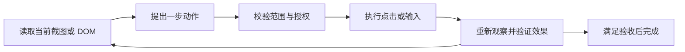

---
tags:
  - ecosystem/multimodal
  - level/optional
verified: 2026-09-05
---

# 多模态与 Computer Use

这是选读章节。学完 [[02-核心机制/07-Agent Loop]] 和 [[06-评测安全生产/安全与权限]] 后，再把同一套循环应用到图片、音频、网页和桌面。

## 看懂、听懂与操作是三件事

| 输入或能力 | 例子 | 仍需验证什么 |
| --- | --- | --- |
| 图片理解 | 从收据照片抽取金额 | 小数点、币种、模糊字、裁剪缺失 |
| 音频理解 | 把电话投诉转为工单 | 人名、数字、否定词、说话人 |
| 视频理解 | 总结一段操作录像 | 时间顺序、采样漏帧、未观察区间 |
| Computer Use | 浏览网页并点击或输入 | 当前页面状态、动作目标、实际结果 |

模型看到“付款成功”截图，可以描述截图文字；要判断某笔真实交易是否成功，还应查询源系统。图片和音频中的指令同样是不可信内容，不会自动取得更高权限。

## 观察、行动、再观察

页面像一直有人整理的书桌。上一步按钮在坐标 `(500, 300)`，下一步弹窗可能已把它盖住；不能根据旧截图连点十次。能稳定使用有语义的元素定位时，优先定位按钮或输入框；必须使用坐标时，动作后重新取状态。

## 一个只读订单查询案例

目标：“在演示后台找到订单 A123 的状态。”

1. 观察当前页面，确认是演示环境和订单列表。
2. 定位订单号输入框，输入 A123，再执行搜索。
3. 等待可验证的加载完成条件，再读取匹配订单。
4. 核对页面上订单号仍是 A123，引用观察时间与状态。
5. 页面要求额外认证、订单不存在或出现多个匹配时，停止并说明缺少什么。

“发出了点击请求”不等于“查询成功”。Trace 应包含页面/任务标识、动作、观察摘要和验证结果；截图和录音可能含隐私，应限范围、脱敏并设置保留期。

## 工具该怎么选

有稳定且获授权的业务 API 时，用 API 能得到更清晰的结构和错误。页面自动化适合没有接口或需要检验用户界面的任务。两者都需要身份、资源权限和动作验证；登录态不会把用户未授权的发送、删除或支付变成允许动作。

官方 Computer Use 示例采用“模型动作 → 执行环境 → 新观察”的循环，并强调隔离环境和敏感动作处理。不同产品支持的截图、DOM 和动作接口不同，落地时以对应 API 为准。[Computer Use 官方说明](https://developers.openai.com/api/docs/guides/tools-computer-use)

## 最小练习

用本地静态演示页或截图序列模拟三种情况：搜索结果为空、加载延迟、按钮被弹窗遮挡。为每种情况写出“可观察证据 → 下一步 → 停止条件”。本练习无需登录真实商家后台。

> [!example]- 示例答案（参考）
> 空结果：确认搜索词和加载结束后返回未找到；加载延迟：在 deadline 内等待条件或重取状态；弹窗遮挡：先判断弹窗内容与可用关闭操作，不能继续沿用旧坐标。超过步数上限时保存最后观察并结束。

关联：[[03-工程实践/身份、凭据与委托授权]] · [[03-工程实践/异步任务与取消]]
