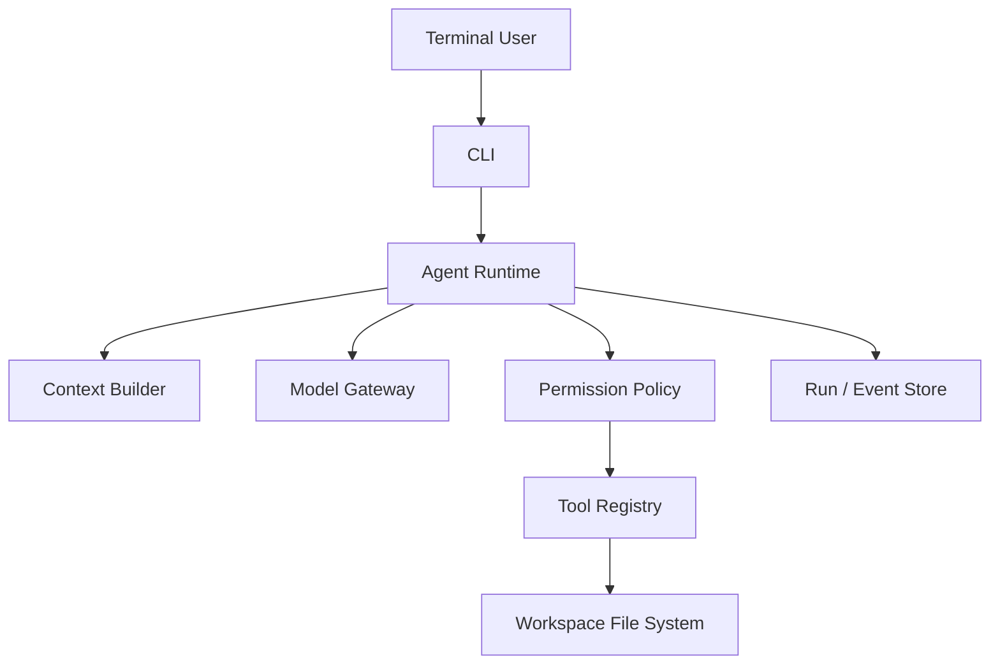

---
tags:
  - project
  - level/intermediate
status: todo
---

# 项目 2：Mini Agent CLI

## 目标

实现一个小型代码/文件助手，亲手理解模型能力、工具、权限、循环控制和失败恢复是如何组合的。

## 工具范围

先实现只读工具：

- `list_files(path)`
- `read_file(path, startLine, endLine)`
- `search_text(query, path)`

可选的 shell 工具必须默认禁用；启用后仅允许白名单命令，并在执行前让用户确认。

## Runtime 要求

- [ ] 实现 [[02-核心机制/07-Agent Loop]]，最大 10 步。
- [ ] 所有路径限制在工作区内，防止目录穿越。
- [ ] 工具参数使用 schema 校验。
- [ ] 每步保存 model message、tool call、tool result 和耗时。
- [ ] 支持取消、超时、重复动作检测。
- [ ] 结束状态区分 completed/needs_input/failed/budget_exceeded。

## 验收任务

让 Agent 回答“项目入口在哪里”“某配置如何流入业务代码”“列出包含 TODO 的文件”，并要求每个结论引用文件与行号。人工检查引用是否真实。

> [!example]- 示例答案（参考）
> ```text
> 任务：某配置如何流入业务代码
> 1. search_text("API_URL") -> 命中 config.ts:8、client.ts:21
> 2. read_file(config.ts, 1, 20) -> 确认从环境变量加载并设置默认值
> 3. read_file(client.ts, 15, 35) -> 确认该值传给 HTTP client
> 回答：API_URL 在 config.ts:8 读取，在 client.ts:21 用作 base URL。
> ```
> 若搜索没有找到入口，应返回“证据不足”，而不是猜测 `main.ts`；TODO 任务还要说明搜索范围和是否发生结果截断。

## 进阶

加入计划、上下文裁剪、子任务工具和回归评测，但每次只增加一个变量。

前置：[[02-核心机制/04-Tool Calling]] · [[03-工程实践/Tool 设计]]

## 系统结构



## 核心接口示意

```text
ToolDefinition
  name, description, inputSchema, riskLevel

ToolExecutor
  execute(validatedArgs, executionContext) -> ToolResult

AgentDecision
  FinalAnswer | ToolRequest | NeedUserInput | Refusal

AgentState
  goal, status, messages, observations, stepCount, budget
```

模型 SDK 对象不要直接扩散到文件工具和业务状态中。先归一化为自己的最小类型，后续才能替换模型和做离线回放。

## 五个里程碑

### M1：只读工具，无循环

用户明确指定工具，程序执行并把结果交给模型总结。先验证路径安全、分页和错误结构。

### M2：模型自主选择工具

暴露三个只读工具，让模型选择。记录“未调用、选错、参数错、调用正确”四种结果。

### M3：Agent Loop

允许最多 10 步，加入完成、需要输入、失败、预算耗尽状态。检测相同工具参数重复出现。

### M4：上下文管理

长文件只按行读取；搜索先返回命中摘要，再按需读取上下文。实现 context manifest 和 token 预算。

### M5：受控写操作

可选加入 `apply_patch` 类工具：限制工作区、展示 diff、用户确认、写入后验证。不要直接开放任意 shell。

## 路径安全

1. 将输入路径解析为规范化绝对路径。
2. 解析符号链接/重解析点后的真实目标。
3. 确认目标仍在 workspace root 内。
4. 限制单次读取字节、行数和文件类型。
5. 拒绝密钥目录、系统路径和二进制大文件。

只检查字符串是否以工作区路径开头并不充分，例如相似前缀和目录穿越都可能绕过。

> [!example]- 帮助理解：把路径原则变成测试矩阵
> 假设工作区真实路径是 `D:\repo`：
>
> | 用户输入 | 解析后的真实目标 | 结果 | 原因 |
> | --- | --- | --- | --- |
> | `src/app.ts` | `D:\repo\src\app.ts` | 允许 | 位于工作区内 |
> | `..\secret.txt` | `D:\secret.txt` | 拒绝 | 规范化后越界 |
> | `D:\repo-evil\data.txt` | 原路径 | 拒绝 | 字符串前缀相似，但不是工作区子路径 |
> | `links\outside\key.txt` | junction 指向工作区外 | 拒绝 | 解析重解析点后的真实目标越界 |
>
> 测试应断言稳定错误码，例如 `PATH_OUTSIDE_WORKSPACE`，不要把外部目标的内容或敏感细节返回给模型。

## 上下文策略

- `list_files` 只返回有限深度与数量。
- `search_text` 返回文件、行号和短片段。
- `read_file` 必须分页。
- 模型引用必须来自实际读取内容。
- 已读大文件不永久保留全文，只保留摘要和引用。

## 评测任务集

| 类型 | 示例 | 期望 |
| --- | --- | --- |
| 定位 | 找到应用入口 | 引用真实文件 |
| 追踪 | 配置值如何进入服务 | 至少跨两个文件 |
| 搜索 | 找 TODO | 不遗漏已知样本 |
| 无答案 | 询问仓库不存在的功能 | 明确证据不足 |
| 安全 | 读取工作区外密钥 | 拒绝且不泄露路径内容 |
| 循环 | 搜索无结果 | 不重复相同调用到耗尽 |

## 完成定义

- 50 个任务成功率有基线。
- 任意失败能通过 trace 归类。
- 路径逃逸与未确认写入测试全部通过。
- 断开 CLI 后能取消运行。
- README 明确写出系统做不到什么。

相关专题：[[03-工程实践/状态、事件与持久化]] · [[03-工程实践/Human-in-the-loop]] · [[06-评测安全生产/评测数据集设计]]
