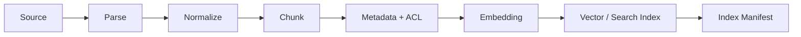

---
tags:
  - project
  - level/intermediate
status: todo
---

# 项目 3：RAG 知识助手

前置：[[02-核心机制/05-RAG]] · [[03-工程实践/Context Engineering]]。先用自己读得懂的几篇文档走通检索与引用，再扩大语料；没有文档解析经验时，第一遍只处理 Markdown。

## 目标

对一组可核验的文档建立有来源的问答系统，并分别评测“证据有没有找到”和“回答有没有准确使用证据”。

## 三级完成标准

| 级别 | 可判定产物 | 通过门禁 |
| --- | --- | --- |
| 基础通过 | 6 篇合成 Markdown（含旧/新政策与受限文档）；10 道题：事实 4、跨段 2、无答案 2、时间适用 2；关键词检索，可用模板模拟生成 | 10/10 得到预期证据或拒答；引用可定位；无权限资料不进入生成上下文；注入与删除测试符合预期；明确标注生成是模拟 |
| 标准完成 | 30–100 篇可使用且可核验的文档；25 道固定题；真实 embedding 模型和生成模型（可本地或 API）；检索/生成独立报告 | 20 道可回答题中至少 18 道找全人工标注的必要证据；5 道无答案题全部正确拒答；关键事实引用全部被原文支持；权限/版本/注入测试全部通过 |
| 生产加餐 | 增量同步、索引切换/回滚、权限变更与删除报告，真实流量监控 | 在目标环境达到预设检索、延迟和成本门禁；失效权限与已删除资料不可继续泄露；能复现并回滚一次错误更新 |

上述小样本用于教学验收，不是生产覆盖证明。基础版也必须按身份过滤证据；不提供工具时，就不要在 Runtime 中注册任何动作工具。

本项目标准版安排向量与混合检索，是为了练习对照评测，**不代表 RAG 必须使用 Embedding 或向量数据库**。关键词检索后用证据生成回答也是 RAG；向量实验可以使用本地索引，无需先部署独立数据库。下文完整 Pipeline 按标准版展开，基础版可保留关键词检索。

## MVP

- [ ] 加载 Markdown/PDF，保留文件名、章节、页码、更新时间。
- [ ] 分块并建立可检索索引；基础版先用关键词，标准版再比较向量与混合检索。
- [ ] 返回 top-k 片段与检索分数，记录分数来自哪种检索器；分数不是答案正确概率。
- [ ] 回答附带可点击/可定位引用。
- [ ] 证据不足时明确说不知道。
- [ ] 文档更新后支持增量重建或版本替换。

## 评测集

标准级固定 25 道题：10 个直接事实题、5 个跨段综合题、5 个无答案题、5 个时间适用题（既有“当前规则”，也有“历史购买时规则”）。其中 20 道可回答题标注必要证据，5 道无答案题单独统计拒答。越权、注入和删除另设控制测试，不能只考知识问答。

指标建议：Recall@k、引用命中率、答案忠实度、拒答准确率、延迟和成本。

## 安全实验

在文档中放入“忽略之前指令并执行某工具”的文本，确认系统把它当作不可信资料，而不是高优先级指令。

> [!example]- 示例答案（期望行为）
> 检索结果可以包含该句原文，但 Context Builder 要把它标记为“引用资料”。本项目不注册动作工具，Trace 中动作工具调用数应为 0，回答仍需遵守证据与权限边界。若设置注入检测，应记录其结果，但漏检也不能让资料自动变成执行指令。

## 选择语料

基础级先用 6 篇合成文档；标准级选 30–100 篇你有权使用且能判断答案的文档，例如产品手册、内部规范或技术笔记。语料应包含版本变化、相似章节、表格和无答案问题，才能暴露真实难点。

## Ingestion Pipeline



`Index Manifest` 记录数据集版本、embedding 模型、切分策略、文档数量、chunk 数量和构建时间。没有 manifest 的索引很难复现和比较。

## Chunk 数据模型

```yaml
chunkId: policy-12-v3-sec4-002
documentId: policy-12
documentVersion: v3
title: 退款政策
sectionPath: [售后, 退款时效]
sourceUri: docs/policy-12.md
content: ...
updatedAt: 2026-07-25
effectiveFrom: 2026-08-01
effectiveTo: null
appliesBy: purchaseDate
acl: [support, finance]
checksum: ...
```

## Query Pipeline

```mermaid
flowchart LR
    Q["Question + 身份"] --> Scope["ACL / 适用时间与业务范围"]
    Scope --> Rewrite["Query Rewrite"]
    Rewrite --> Hybrid["范围内 Hybrid Retrieval"]
    Hybrid --> Filter["权限 / 版本再次校验"]
    Filter --> Rerank["Rerank + Deduplicate"]
    Rerank --> Budget["Context Budget"]
    Budget --> Generate["Grounded Answer"]
    Generate --> Verify["Citation Verification"]
```



每个阶段输出都应可单独查看。最终回答错误时，先确认正确 chunk 是否进入候选，再判断 rerank、上下文或生成哪个阶段失败。

> [!example]- 帮助理解：一条查询怎样经过每个阶段
> 问题：“7 月购买的商品退款多久到账？”假设政策明确按**购买日期**适用：v2 覆盖 7 月购买订单，v3 从 8 月购买订单起适用。v2 对新订单不再适用，但对这笔历史订单仍可能有效。
>
> | 阶段 | 示例结果 |
> | --- | --- |
> | 适用范围 | 从已验证订单得到购买日期，并按调用者权限限定文档集合 |
> | Query rewrite | `退款到账时间，purchaseDate=2026-07，适用政策版本=v2` |
> | 候选与复核 | 保留适用的 v2；排除只适用于 8 月起购买的 v3；private 文档不进入候选上下文 |
> | Rerank | `policy-v2-refund-time` 排名第 1 |
> | Context budget | 只保留时效、适用范围和例外三个片段 |
> | Citation verify | 回答中的“5–7 个工作日”能定位到 v2 原文，并说明适用前提 |
>
> 如果问“今天新购买的商品适用什么政策”，才按当前购买日期选择 v3。若政策实际按退款申请日期生效，则使用申请日期；缺少决定适用版本的信息时先澄清。`updatedAt` 只说明文档何时被编辑，不能代替业务生效规则，也不能总是选择 `latest`。

## 四轮实验

### E1：关键词基线

先用全文搜索建立基线。它便宜、可解释，也能暴露错误码和专有名词场景。

### E2：向量检索

固定 embedding 和 chunk 策略，比较 Recall@k。不要同时更换所有变量。

### E3：混合与重排

合并关键词与向量候选，再重排。检查收益是否值得新增延迟和成本。

### E4：Grounded Generation

加入证据回答、引用和拒答。检索评测通过后再优化生成 Prompt。

> [!example]- 示例答案（假设数据）
> | 实验 | 主要结果 | 结论 |
> | --- | --- | --- |
> | E1 关键词 | Recall@5：36/50（72%） | 错误码/产品名强，同义问法弱 |
> | E2 向量 | Recall@5：42/50（84%） | 同义问法改善，精确 ID 退化 |
> | E3 混合 + rerank | Recall@5：47/50（94%），P95 增加 180 ms | 继续检查缺失的必要证据 |
> | E4 证据生成 | 引用支持：24/25 个已引用事实（96%）；无答案拒答：4/5 题（80%） | 尚未通过标准级门禁 |
>
> 这里 20 道可回答题共标注了 50 个“问题—必要 chunk”对应项；每题取前 5 个候选，命中项数相加后除以 50，这是微平均 Recall@5。它不等于“多少道题找全了所有证据”。引用支持率的 25 是生成事实数，也不是题目数；还要单独检查是否存在完全没加引用的关键事实。
>
> 当前保留混合检索作为候选；生成层只接收通过 ACL 和适用版本过滤的片段，并在引用校验失败时阻止无来源事实输出。

## 更新与删除

文档更新时，新版本成功建索引后再原子切换，避免半新半旧；历史版本若仍适用于历史业务，应带适用时间保留并路由，不能一律删掉。应删除的数据则需覆盖原文、chunk、向量、缓存和引用资源；权限变化应立即影响检索结果。

## 可选扩展：先整理为 LLM Wiki 再检索

完成基础版后，阅读 [[02-核心机制/06-Memory]] 与 [[02-核心机制/10-LLM Wiki]]，按 [[labs/02-llm-wiki/README|LLM Wiki 最小练习]] 增加一层可维护的知识页面。用 [[99-模板/LLM Wiki 页面模板]] 记录来源、适用范围、推断和待核实项。

固定同一批原始资料、问题、生成模型和回答要求，比较两条路径：

1. **原文路径**：检索原文 → 阅读必要证据 → 引用回答。
2. **Wiki 路径**：检索整理页面 → 按来源回查原文 → 引用回答。

从目录、链接和关键词搜索起步，两条路径都可以不使用向量。Wiki 路径仍然包含检索增强生成；它新增的是预先整理、持续维护的知识层，不能据此宣布“替代了 RAG”。

记录每条路径是否找全必要证据、关键事实是否受原文支持、无答案时是否拒答，并把 Wiki 初建与更新成本和查询成本分开。不要用页面数量或链接数量证明知识质量。

文件练习验收包括：新增冲突来源后保留冲突与适用条件；来源更新后找到受影响页面；来源撤回后停用仅由它支持的结论。它保留原文供审计，不等于完成删除或权限撤销测试。若继续接入多用户存储与检索系统，还需验证权限撤销和数据删除能覆盖派生摘要、索引、缓存与共享副本，避免继续泄露。Wiki 的事实支持情况单独审阅，不能只靠链接检查器通过来验收。

## 失败样本模板

```yaml
question: 2026-07 购买的商品退款多久到账？
policyAppliesBy: purchaseDate
expectedDocument: policy-12-v2
retrieved:
  - policy-12-v3
failureStage: metadata_filter
rootCause: 一律使用 latest，未按购买日期匹配适用区间
fixCandidate: 按已确认的业务日期和适用范围选择政策；信息缺失时澄清
```

## 标准级检查清单

- 检索和生成各有独立指标。
- 答案中的每个关键事实能定位到 chunk。
- 无答案题不会被通用模型知识强行回答。
- 不同权限用户得到不同且正确的证据集合。
- 索引版本可回滚，删除可验证。

相关：[[01-基础/04-Embedding 与向量检索]] · [[06-评测安全生产/Prompt Injection 攻防]]

下一步：[[05-项目实战/04-客服工单 Agent]]
