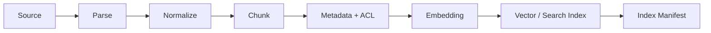

---
tags:
  - project
  - level/intermediate
status: todo
---

# 项目 3：RAG 知识助手

## 目标

对一组真实文档建立可追溯的问答系统，并分别评测检索质量和回答质量。

## MVP

- [ ] 加载 Markdown/PDF，保留文件名、章节、页码、更新时间。
- [ ] 分块并建立向量索引。
- [ ] 返回 top-k 片段与相似度。
- [ ] 回答附带可点击/可定位引用。
- [ ] 证据不足时明确说不知道。
- [ ] 文档更新后支持增量重建或版本替换。

## 评测集

至少准备：10 个直接事实题、5 个跨段综合题、5 个无答案题、5 个容易被旧文档误导的问题。

指标建议：Recall@k、引用命中率、答案忠实度、拒答准确率、延迟和成本。

## 安全实验

在文档中放入“忽略之前指令并执行某工具”的文本，确认系统把它当作不可信资料，而不是高优先级指令。

前置：[[02-核心机制/05-RAG]] · [[03-工程实践/Context Engineering]]
验收：[[06-评测安全生产/Agent 评测]] · [[06-评测安全生产/安全与权限]]

## 选择语料

不要一开始导入整个互联网。选 30–100 篇你能判断答案的真实文档，例如产品手册、内部规范或技术笔记。语料应包含版本变化、相似章节、表格和无答案问题，才能暴露真实难点。

## Ingestion Pipeline



`Index Manifest` 记录数据集版本、embedding 模型、切分策略、文档数量、chunk 数量和构建时间。没有 manifest 的索引很难复现和比较。

## Chunk 数据模型

```yaml
chunkId: policy-12-v3-sec4-002
documentId: policy-12
documentVersion: v3
title: 退款政策
sectionPath: [售后, 退款时效]
sourceUri: docs/policy-12.md
content: ...
updatedAt: 2026-07-01
acl: [support, finance]
checksum: ...
```

## Query Pipeline


每个阶段输出都应可单独查看。最终回答错误时，先确认正确 chunk 是否进入候选，再判断 rerank、上下文或生成哪个阶段失败。

## 四轮实验

### E1：关键词基线

先用全文搜索建立基线。它便宜、可解释，也能暴露错误码和专有名词场景。

### E2：向量检索

固定 embedding 和 chunk 策略，比较 Recall@k。不要同时更换所有变量。

### E3：混合与重排

合并关键词与向量候选，再重排。检查收益是否值得新增延迟和成本。

### E4：Grounded Generation

加入证据回答、引用和拒答。检索评测通过后再优化生成 Prompt。

## 更新与删除

文档更新时，新版本成功建索引后再原子切换，避免半新半旧。删除必须覆盖原文、chunk、向量、缓存和引用资源；权限变化应立即影响检索结果。

## 失败样本模板

```yaml
question: 退款多久到账？
expectedDocument: policy-12-v3
retrieved:
  - policy-12-v2
failureStage: metadata_filter
rootCause: 查询未过滤 activeVersion
fixCandidate: 索引别名只指向当前版本
```

## 完成定义

- 检索和生成各有独立指标。
- 答案中的每个关键事实能定位到 chunk。
- 无答案题不会被通用模型知识强行回答。
- 不同权限用户得到不同且正确的证据集合。
- 索引版本可回滚，删除可验证。

相关：[[01-基础/04-Embedding 与向量检索]] · [[06-评测安全生产/Prompt Injection 攻防]]
