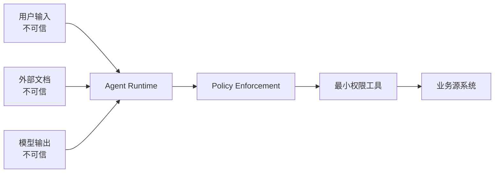

---
tags:
  - security
status: seed
---

# 安全与权限

## 基本假设

用户输入、网页、文档、工具返回和模型输出都可能包含恶意或错误内容。任何文本都不能自行提升为系统指令或执行权限。

## 主要威胁

- Prompt Injection：不可信内容诱导 Agent 忽略规则。
- Tool Abuse：模型调用不必要或高风险工具。
- 数据泄露：跨用户、跨租户或日志泄露敏感信息。
- 过度授权：一个工具拥有超出任务需要的系统权限。
- 不可逆操作：发送、删除、支付等动作缺少确认。

## 防护层

1. **身份层**：真实用户身份和租户上下文由应用注入。
2. **策略层**：按用户、资源、动作独立授权。
3. **工具层**：最小权限、schema 校验、超时、幂等。
4. **交互层**：高风险动作先预览，再明确确认。
5. **数据层**：敏感字段最小化、脱敏、保留期限。
6. **审计层**：记录谁在何时让什么工具对哪个资源做了什么。

## 红线

模型不能持有长期主密钥；不能通过 Prompt 绕过后端鉴权；不能把“用户说他有权限”当作授权证据。

## 测试

为每个写工具设计越权、重复、注入、超时、部分失败和取消样本，并加入 [[06-评测安全生产/Agent 评测|回归评测集]]。

## 信任边界图

Runtime 接受不可信输入，但只有 Policy 和 Tool 执行层能授予动作能力。

## 权限模型

一次工具授权至少考虑：subject（谁）、tenant（哪个租户）、action（什么动作）、resource（哪个资源）、conditions（时间/金额/状态）和 purpose（本次任务目的）。只有工具名白名单不够。

## 数据最小化

- 给模型的字段按任务裁剪，不返回整个客户对象。
- RAG 在检索阶段做 ACL 过滤。
- trace 中默认只保留脱敏摘要。
- 不把 access token、cookie、连接串传入 Prompt。
- 子 Agent 只得到子任务需要的数据。

## 沙箱

文件、代码和浏览器类 Agent 需要额外隔离：工作区根目录、网络出口、进程权限、CPU/内存/时间、依赖安装和密钥访问都要受控。沙箱不是 Prompt 的替代品，而是错误真正发生时的最后边界。

## 供应链

第三方模型、MCP Server、插件、Prompt 模板和数据加载器都可能成为供应链入口。固定版本、验证来源、限制能力，并在升级后运行安全回归。

## 事件响应

安全事件发生时要能：停止相关 run、撤销令牌、隔离工具、定位受影响用户、删除泄露缓存、保留合规审计、回滚控制面版本并通知责任人。

深入：[[06-评测安全生产/Prompt Injection 攻防]] · [[03-工程实践/Human-in-the-loop]]
